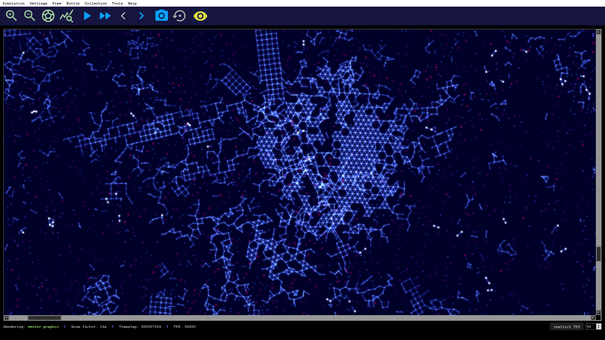
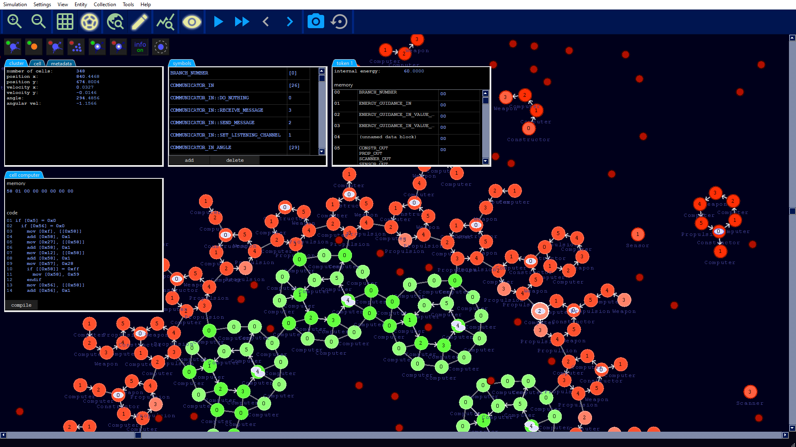

<h1 align="center">
<a href="https://alien-project.org" target="_blank">ALiEn - Explore the world of artificial life</a>
</h1>

<h1 align="center">

</h1>
Artificial Life Environment (ALiEn) is a simulation program based on a specialized 2D physics and rendering engine in CUDA. Each simulated body has a graph-like structure of connected building blocks that can either be programmed or equipped with functions to act in the world (accelerators, sensors, weapons, constructors, etc.). Such internal processes are triggered by signals coming from circulating tokens. The bodies can be thought of as small machines or agents operating in a common environment.

## Main features
### Physics and graphics engine
- Realistic physical computations of heat dissipation, collisions, bondings, damages, rotational forces, etc.
- Simulation and rendering on GPU via CUDA and OpenGL
- Post-processing filters such as glow and motion blur
- interactive

### Artificial Life extensions
- Programmable matter approach for simulating digital organisms and evolution
- Built-in code and graph editor for designing own machines 

The simulation code is written entirely in CUDA and highly optimized for large-scale real-time simulations of millions of bodies and particles.
The development is driven by the desire to better understand the conditions for (pre-)biotic evolution and the growing complexity of biological systems.

## But for what is this useful?
- A first attempt to answer: Feed your curiosity by watching evolution at work! As soon as self-replicating machines come into play and mutations are turned on, the simulation itself does everything.
- Perhaps the most honest answer: Fun! It is almost like a game with a pretty fast and realistic physics engine. You can make hundreds of thousands of machines accelerate and destroy with the mouse cursor. It feels like playing god in your own universe with your own rules. Different render styles and a visual editor offer fascinating insights into the events. There are a lot of videos on the [YouTube channel](https://youtube.com/channel/UCtotfE3yvG0wwAZ4bDfPGYw) for illustration.
- A more academic answer: A tool to tackle fundamental questions of how complexity or life-like structure may arise from simple components. How do entire ecosystems adapt to environmental changes and find a new equilibrium? How to find conditions that allow open-ended evolution?

**Further information and artworks**
* [Website](https://alien-project.org)
* [YouTube](https://youtube.com/channel/UCtotfE3yvG0wwAZ4bDfPGYw)
* [Twitter](https://twitter.com/chrx_h)
* [Reddit](https://www.reddit.com/r/AlienProject)

## Minimal system requirements
An Nvidia graphics card with compute capability 6.0 or higher is needed. Please check [https://en.wikipedia.org/wiki/CUDA#GPUs_supported](https://en.wikipedia.org/wiki/CUDA#GPUs_supported).

## Installer
An installer for 64-bit binaries is provided for Windows 10: [download link](https://alien-project.org/downloads.html).

## Documentation
Please visit [alien-project.org](https://alien-project.org/documentation.html) for a documentation of the program and the underlying model. A completely new documentation with many tutorials that guide the reader into the program in small portions is currently in construction.

## Screenshots
#### Startup screen
<h1 align="center">

</h1>

#### Evolving self-replicating machines in action
<h1 align="center">

</h1>

#### Debris after heavy impact
<h1 align="center">

</h1>

#### Graph structure of the bodies
<h1 align="center">

</h1>

#### Visual editor for programming the machines
<h1 align="center">

</h1>

## How to build the sources
To build alien you need Microsoft Visual Studio 2019. You find the solution file in msvc/alien/alien.sln.
The following third-party libaries are necessary and should be installed:
- [Qt 6.0.2](https://www.qt.io/download)
- [CUDA 11.2](https://developer.nvidia.com/cuda-11.2.0-download-archive)
- [boost library version 1.75.0](https://www.boost.org/users/history/version_1_75_0.html) (needs to be installed in external/boost_1_75_0)
- [OpenSSL version 1.1.1j](https://slproweb.com/products/Win32OpenSSL.html) (not mandatory, only used for bug reporting feature)

## License
alien is licensed under the [GPLv3](LICENSE).

  

