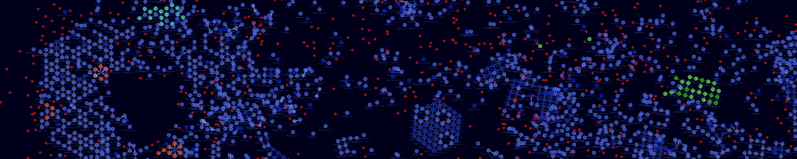
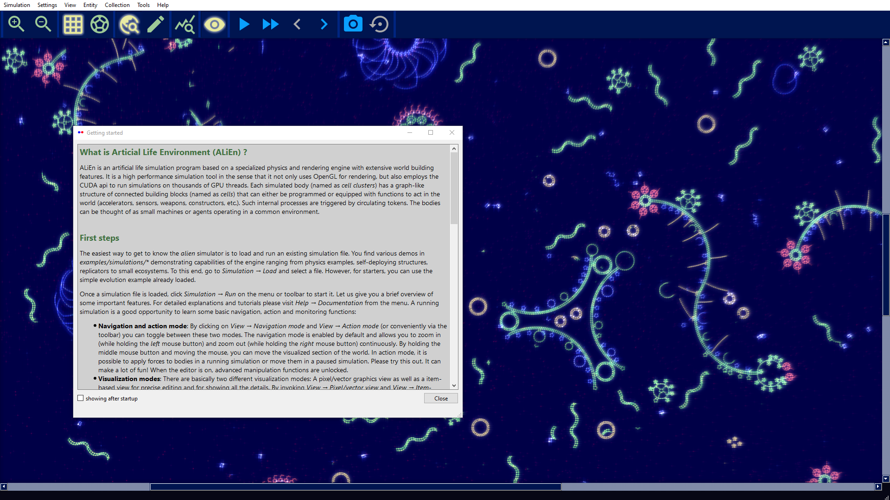
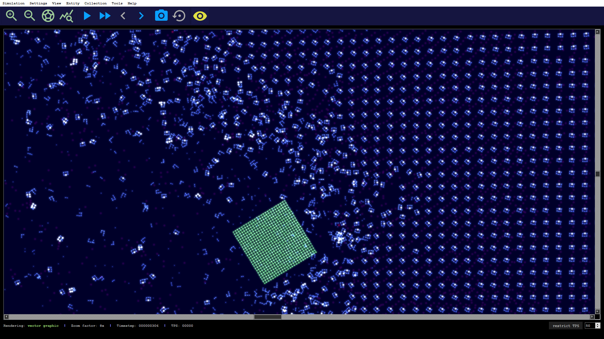
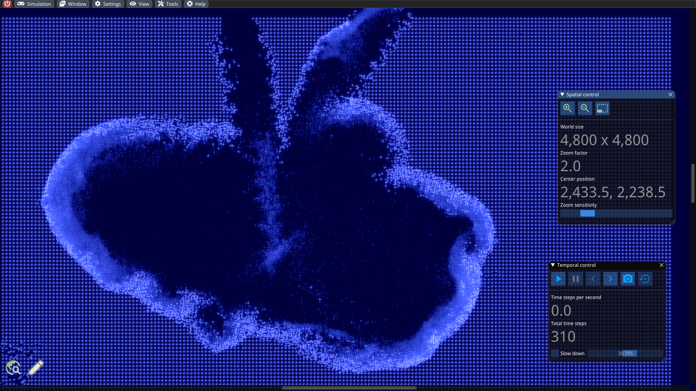
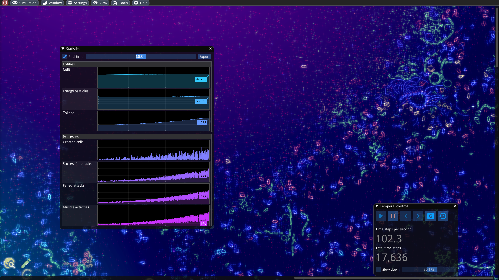
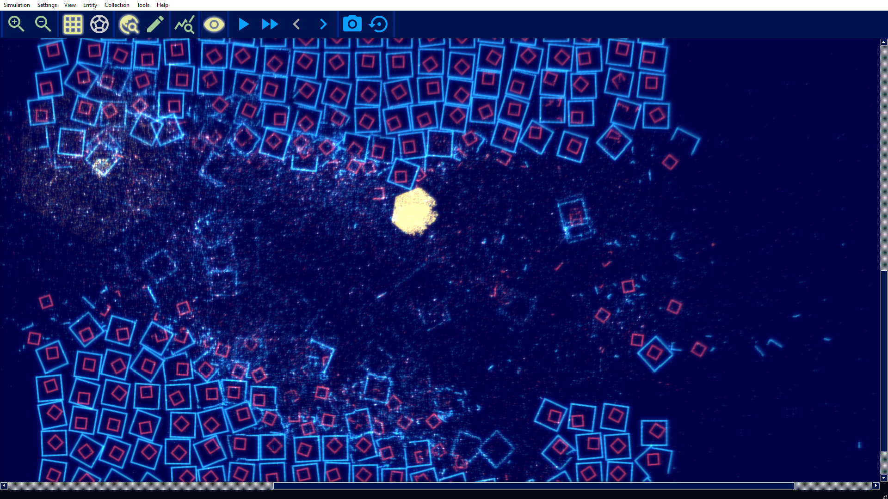

<h1 align="center">
<a href="https://alien-project.org" target="_blank">ALIEN - Explore the world of artificial life</a>
</h1>

<h1 align="center">

</h1>
<p>
<b><i>A</i></b>rtificial <b><i>LI</i></b>fe <b><i>EN</i></b>vironment <b>(ALIEN)</b> is an artificial life simulation tool based on a specialized 2D particle engine in CUDA for soft bodies and fluid-like media. Each simulated body consists of a network of particles that can be enriched with higher-level functions, ranging from pure information processing capabilities to physical equipment (such as sensors, muscles, weapons, constructors, etc.) whose executions are orchestrated by a signaling system. The bodies can be thought of as agents or digital organisms operating in a common environment.
</p>
<p>
The simulation code is written entirely in CUDA and optimized for large-scale real-time simulations with millions of particles.
The development is driven by the desire to better understand the conditions for (pre-)biotic evolution and the growing complexity of biological systems.
An important goal is to make the simulator user-friendly through a modern user interface, visually appealing rendering and a playful approach. 
</p>

# Main features
### Physics and graphics engine
- Particles for simulating soft body mechanics, heat dissipation, bondings, damages, phase transitions, etc.
- Real-time user interactions with running simulations
- Simulation runs entirely on GPU via CUDA
- Rendering and post-processing via OpenGL using CUDA-OpenGL interoperability


### Artificial Life extensions
- Programmable particle actions for simulating digital organisms and studying evolution
- Information and energy transportation layer between connected particles
- Allow spatiotemporally varying simulation parameters


### Extensive editing capabilities
- Built-in graph editor
- Built-in programming environment for designing customized machines and worlds
- Mass-operations and (up/down) scaling functions for simulations

# But for what is this useful?
- A first attempt to answer: Feed your curiosity by watching evolution at work! As soon as self-replicating machines come into play and mutations are turned on, the simulation itself does everything.
- Perhaps the most honest answer: Fun! It is almost like a game with a pretty fast and realistic physics engine. You can make hundreds of thousands of machines accelerate and destroy with the mouse cursor. It feels like playing god in your own universe with your own rules. Different render styles and a visual editor offer fascinating insights into the events. There are a lot of videos on the [YouTube channel](https://youtube.com/channel/UCtotfE3yvG0wwAZ4bDfPGYw) for illustration.
- A more academic answer: A tool to tackle fundamental questions of how complexity or life-like structure may arise from simple components. How do entire ecosystems adapt to environmental changes and find a new equilibrium? How to find conditions that allow open-ended evolution?

**Further information and artworks**
* [Website](https://alien-project.org)
* [YouTube](https://youtube.com/channel/UCtotfE3yvG0wwAZ4bDfPGYw)
* [Twitter](https://twitter.com/chrx_h)
* [Reddit](https://www.reddit.com/r/AlienProject)

# Documentation
A documentation, which introduces the reader to the simulator with tutorial-like articles can be found at [alien-project.gitbook.io/docs](https://alien-project.gitbook.io/docs).

# Minimal system requirements
An Nvidia graphics card with compute capability 5.2 or higher is needed. Please check [https://en.wikipedia.org/wiki/CUDA#GPUs_supported](https://en.wikipedia.org/wiki/CUDA#GPUs_supported).

# How to build the sources
The build process is mostly automated using the cross-platform CMake build system and the vcpkg package manager, which is included as a Git submodule.

### Getting the sources
To obtain the sources, please open a command prompt in a suitable directory (which should not contain whitespace characters) and enter the following command:
```
git clone --recursive https://github.com/chrxh/alien.git
```
Note: The `--recursive` parameter is necessary to check out the vcpkg submodule as well. Besides that, submodules are not normally updated by the standard `git pull` command. Instead, you need to write `git pull --recurse-submodules`.

### Build instructions
Prerequisites: [CUDA Toolkit 11.2+](https://developer.nvidia.com/cuda-downloads) and a toolchain for CMake (e.g. GCC 9.x+ or [MSVC v142+](https://visualstudio.microsoft.com/de/free-developer-offers/))

Build steps:
```
mkdir build && cd build
cmake .. -DCMAKE_BUILD_TYPE=Release
cmake --build . --config Release -j8
```
If everything goes well, the ALIEN executable can be found under the build directory in `./alien` or `.\Release\alien.exe` depending on the used toolchain and platform.

# Installer
An installer for 64-bit binaries is provided for Windows 10: [download link](https://alien-project.org/media/files/alien-installer.zip).

In the case that the program crashes for an unknown reason, please refer to the troubleshooting section in [alien-project.org/downloads.html](https://alien-project.org/downloads.html).

# Contributing to the project
Contributions for the project are very welcome. The most convenient way is to communicate via [GitHub Issues](https://github.com/chrxh/alien/issues), [Pull requests](https://github.com/chrxh/alien/pulls) or the [Discussion forum](https://github.com/chrxh/alien/discussions) depending on the subject. For example, it could be
- Pull requests for bug fixes, code cleaning or minor tweaks. If you want to implement new features, refactorings or other major changes, please [contact me](mailto:info@alien-project.org) in advance.
- Providing new content (simulation or pattern files)
- Extensions or corrections of the [alien-docs](https://alien-project.gitbook.io/docs). It has its [own repository](https://github.com/chrxh/alien-docs).
- Reporting of bugs, wanted features, questions or feedback via GitHub Issues or in the Discussion forum.

A short architectural overview of the source code can be found in the [documentation](https://alien-project.gitbook.io/docs/under-the-hood).

# Dependency list
- [CUDA Toolkit](https://developer.nvidia.com/cuda-toolkit)
- [Dear ImGui](https://github.com/ocornut/imgui)
- [ImPlot](https://github.com/epezent/implot)
- [ImFileDialog](https://github.com/dfranx/ImFileDialog)
- [boost](https://www.boost.org)
- [Glad](https://glad.dav1d.de)
- [GLFW](https://www.glfw.org)
- [glew](https://github.com/nigels-com/glew)
- [stb](https://github.com/nothings/stb)
- [cereal](https://github.com/USCiLab/cereal)
- [zlib](https://www.zlib.net)
- [zstr](https://github.com/mateidavid/zstr)
- [IconFontCppHeaders](https://github.com/juliettef/IconFontCppHeaders)
- [googletest](https://github.com/google/googletest)

# Screenshots
#### Startup screen
<h1 align="center">

</h1>

#### Evolving self-replicating machines in action
<h1 align="center">

</h1>

#### Explosion inside a large grid of robots
<h1 align="center">

</h1>

#### Statistics tools
<h1 align="center">

</h1>

#### Pattern editor and programming environment
<h1 align="center">

</h1>

# License
ALIEN is licensed under the [GPLv3](LICENSE).
