# Cell types

This chapter describes every cell type in detail: what it does, which signal channels it reads and writes, its properties and the simulation parameters that affect it. It also covers the constructor, which is not a cell type of its own but can be added to almost any cell.

## How cell types work

Every cell runs in cycles of 6 time steps. In each cycle, the neural network of the cell first calculates the eight channels of its signal. Then the cell type executes its function. It reads channels of the signal as inputs and may overwrite some channels with its results. The connected cells see these results in the next cycle. See [Neural networks and signals](neural-networks.md) for the details of this process.

Some general rules apply to all cell types:

- A cell is only active when it is **ready**. Cells under construction stay inactive until their creature or body part is complete.
- Many cell types act only when they are **triggered**. A cell is triggered when the absolute value of channel #0 is at least **0.1**. Some cell types additionally distinguish between positive and negative values.
- Cell types that need a direction, such as sensors, muscles and communicators, use the **front direction** of the creature. It is defined in the genome and passed from the head cell to all other cells. Such cells only work in cells that belong to a creature with a head cell.
- Channel values range from -2 to 2. Directions are encoded as a value between -1 and 1, which corresponds to an angle between -180 and 180 degrees relative to the front direction.
- Energy that a cell type spends, for example for an attack, is not lost. It is emitted as energy particles.

| Cell type | Triggered by | Reads | Writes |
| --- | --- | --- | --- |
| [Base](#base) | | | |
| [Depot](#depot) | #0 | #0 | |
| [Sensor](#sensor) | every cycle or #0 | #0 | #0 to #3 |
| [Generator](#generator) | every cycle | | #0 |
| [Attacker](#attacker) | #0 | | #2 |
| [Injector](#injector) | #0 | | #1 |
| [Muscle](#muscle) | every cycle | #0, #1 | |
| [Defender](#defender) | passive | | |
| [Reconnector](#reconnector) | #0 | #0 | #2 |
| [Detonator](#detonator) | #0 | | |
| [Digestor](#digestor) | every cycle | | |
| [Memory](#memory) | every cycle | #0 and all channels | selected channels |
| [Communicator](#communicator) | #0 (sender) | all channels | all channels (receiver) |
| [Void](#void) | after construction | | |
| [Constructor](#constructor) | interval or #0 | #0 | #4 |

## Base

A base cell has no special function. Only its neural network is executed. Base cells are the right choice for the structure of a body, for relaying signals and for processing signals with their neural network.

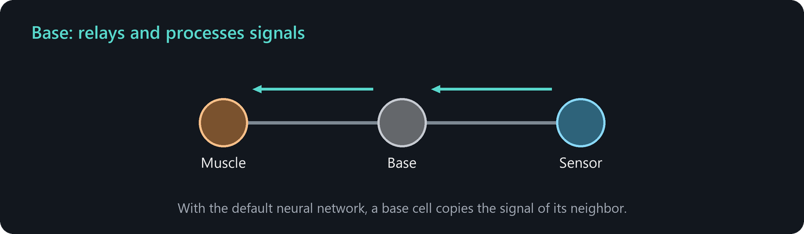

**Example:** A chain of base cells between a sensor and the muscles carries the sensor signal unchanged, because the default neural network copies the signal. A base cell with a modified neural network can, for example, invert a direction or combine two signals.

## Depot

A depot stores usable energy and gives it back on demand. It acts as an energy reserve of the creature.

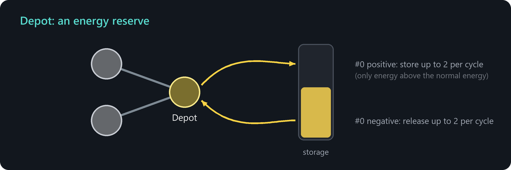

### Signals

| Channel | Meaning |
| --- | --- |
| #0 (input) | Greater than or equal to 0.1: store energy. Less than or equal to -0.1: release energy. |

When storing, the depot moves up to 2 energy units per cycle from its usable energy into the storage, but only the part above the normal energy. When releasing, it moves up to 2 units per cycle back. The stored energy is part of the creature: attackers can steal it, and it can be released to feed the other cells through the normal energy flow.

### Properties

| Property | Meaning |
| --- | --- |
| Max energy for storage | Maximum usable energy that the depot can hold. The simulation limits the storage to 500 in any case. |
| Stored energy | The currently stored energy (inspection only). |

**Example:** Use the telemetry input *Energy* of the neural network: store when the energy of the cell is high and release when it is low.

## Sensor

A sensor scans the surroundings and reports the closest match. It is the eye of a creature.

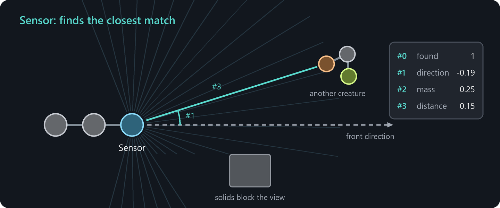

### Signals

| Channel | Meaning |
| --- | --- |
| #0 (input) | Triggers a scan if **Auto trigger** is off and the absolute value is at least 0.1. A negative value switches to tracking, see below. |
| #0 (output) | 1 if something was found, otherwise 0. |
| #1 (output) | Direction of the match relative to the front direction, between -1 and 1. |
| #2 (output) | Mass of the match: the density of energy particles or free cells between 0 and 1, or for creatures a value that grows with their size (0.5 for 30 cells, 0.75 for 60 cells, 1 for 120 cells or more). |
| #3 (output) | Distance of the match: 1 means very close, 0 means 256 units or farther. |

Channels #1 to #3 are only written when something is found.

### How scanning works

The sensor sends 64 scan rays in all directions and reports the closest match. Solids block the rays, so creatures cannot see through rocks and walls. The connections of the own creature close to the sensor block the rays as well. A sensor in the middle of a body therefore sees less than a sensor at the edge.

If channel #0 is negative and the sensor already has a match, it does not scan all around but follows the previous match in its vicinity. This is useful for keeping track of a moving target.

### Modes

| Mode | Detects |
| --- | --- |
| Detect energy | Concentrations of energy particles with at least the **Min density**. |
| Detect solid | Solid objects. |
| Detect free cell | Concentrations of free cells with at least the **Min density**, optionally restricted to colors. |
| Detect creature | Cells of other creatures, optionally restricted by size, color and lineage. |

### Properties

| Property | Meaning |
| --- | --- |
| Auto trigger | Scan in every cycle. Otherwise channel #0 triggers the scan. |
| Tag for attackers | Attacker cells of the same creature may attack the creatures that this sensor detects in the mode *Detect creature*. These are the match and up to 3 further matching creatures near it. Only the scan of the current cycle counts. |
| Min range, Max range | Only matches between these distances are detected. |
| Min density | For energy and free cells: the required density between 0 and 1. |
| Restrict to colors | Only objects with one of the selected colors are detected. |
| Min creature cells, Max creature cells | For creatures: limits for the number of cells of the target creature. |
| Restrict to lineage | For creatures: only related creatures, only foreign creatures or no restriction. |

**Parameter:** *Cell type: Sensor > Radius* limits the range of all sensors (255 by default).

**Example:** A sensor at the last node of a gene followed by muscles in the mode *Direct movement* creates a creature that moves towards what the sensor detects. The muscles read the found flag from channel #0 as strength and the direction from channel #1. This design is built step by step in [Your first creature](first-creature.md).

## Generator

A generator produces a periodic signal in channel #0, like a heartbeat or a clock.

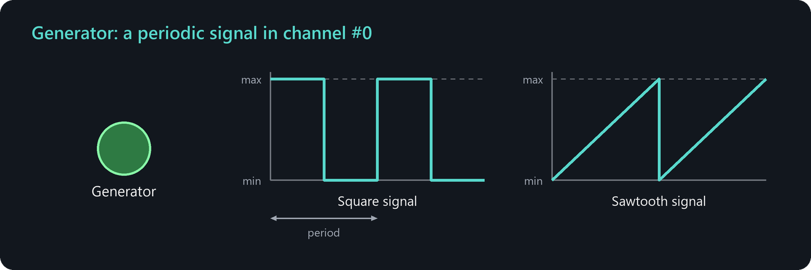

### Signals

| Channel | Meaning |
| --- | --- |
| #0 (output) | The generated value. |

### Properties

| Property | Meaning |
| --- | --- |
| Mode | *Square signal*: the maximum value during the first half of the period, the minimum value during the second half. *Sawtooth signal*: rises linearly from the minimum to the maximum value over the period. |
| Period | Length of one period in time steps. Since cells run every 6 time steps, multiples of 6 work best. |
| Min value, Max value | The two levels of the signal, between -2 and 2. |
| Time offset | Shifts the phase by this number of time steps. |
| Additive | Adds the value to channel #0 instead of replacing it. |

**Example:** A square signal into a memory cell in the mode *Signal recorder* triggers a recording at regular intervals. With equal minimum and maximum values, the generator produces a constant signal, which is a simple way to activate muscles permanently.

## Attacker

An attacker steals energy from free cells or from cells of other creatures. It is the mouth or the weapon of a creature.

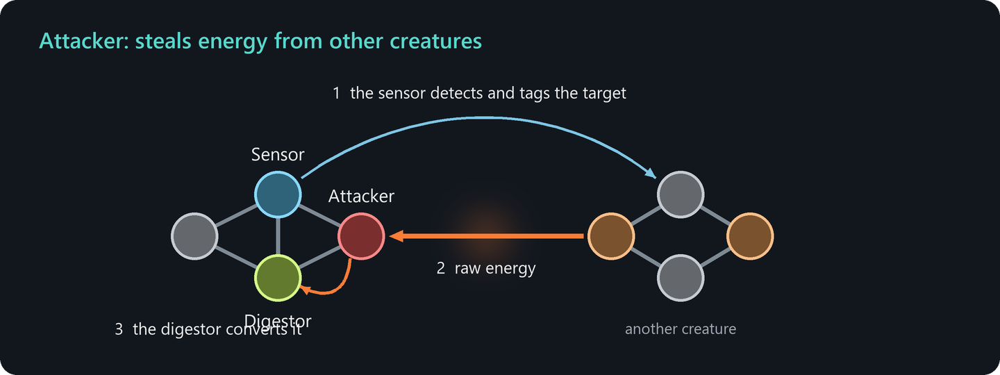

### Signals

| Channel | Meaning |
| --- | --- |
| #0 (input) | Triggers an attack if the absolute value is at least 0.1. |
| #2 (output) | Success: the stolen energy divided by 10, between 0 and 1. |

### How attacks work

An attack hits all suitable targets within the **attack radius** that are not hidden behind cells of the own creature. The stolen energy is added to the **raw energy** of the attacker. Raw energy is not usable directly. It flows into directly connected **digestor** cells, which convert it. An attacker without a digestor next to it is therefore useless. An attacker only attacks again when its raw energy has dropped below 2.

The amount of energy depends on several factors:

- **Attack strength** sets the fraction of the energy of the target that is stolen per time step.
- The **food chain color matrix** scales the amount depending on the colors of attacker and target.
- **Defender** cells at the target reduce the amount.
- **Same lineage protection** reduces attacks on related creatures and **Size protection** reduces attacks on larger creatures.

Each attack attempt costs the **energy cost**, which is emitted as energy particles. An attacker does not attack if this would bring its usable energy below the minimum energy.

### Modes

| Mode | Targets |
| --- | --- |
| Free cell | Free cells, optionally restricted to colors. |
| Creature | Cells of other creatures. Only creatures that a sensor of the same creature has detected and tagged in the current cycle are attacked, see **Tag for attackers** of the sensor. Own offspring are never attacked. |

**Parameters:** group *Cell type: Attacker* with **Energy cost**, **Food chain color matrix**, **Attack strength**, **Same lineage protection**, **Size protection** and **Attack radius** (2 by default).

**Example:** A predator needs a sensor in the mode *Detect creature* with **Tag for attackers**, an attacker and a digestor connected to the attacker. The sensor has to scan in the same cycle in which the attacker is triggered, for example with **Auto trigger**. The sensor signal can trigger the attacker through channel #0.

## Injector

An injector infects a cell of another creature with its own genome, like a virus. The infected cell starts to build what the injector tells it.

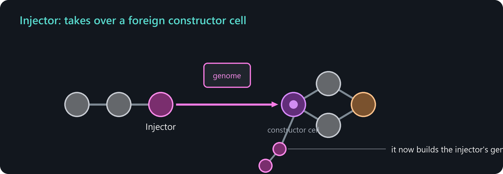

### Signals

| Channel | Meaning |
| --- | --- |
| #0 (input) | Triggers an injection if the absolute value is at least 0.1. |
| #1 (output) | 1 if an injection succeeded, otherwise 0. |

### How injection works

The injector looks for a cell of another creature within the **injection radius** that has a constructor, is not static and whose genome has no **Resistance to injection**. The target cell is taken over: it receives a copy of the genome of the injector, its constructor is set to build the gene given by the **Gene index** of the injector and starts anew.

An injection costs the **energy cost** of the injector, 250 by default, which is emitted as energy particles. Each defender in the mode *Anti-injector* connected to the target makes it more expensive. The injector only acts if its usable energy stays above the minimum energy after paying.

### Properties

| Property | Meaning |
| --- | --- |
| Gene index | The gene of the injector genome that the infected cell builds. |

**Parameters:** group *Cell type: Injector* with **Energy cost** and **Injection radius** (3 by default).

## Muscle

A muscle moves the creature. It can bend joints, stretch connections or accelerate itself directly.

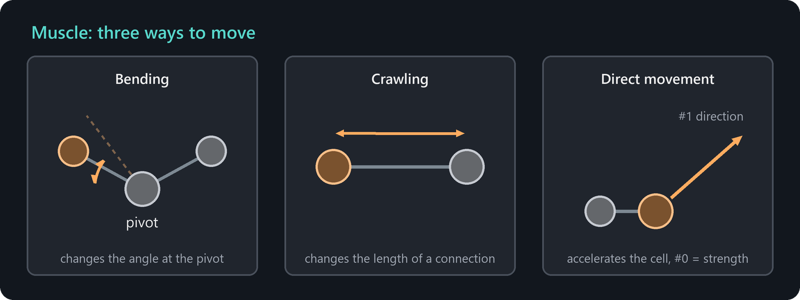

### Signals

| Channel | Meaning |
| --- | --- |
| #0 (input) | Activation: strength and, in the manual modes, direction of the action. Values are limited to -1 to 1. |
| #1 (input) | Direction for the modes *Auto bending*, *Angle bending* and *Direct movement*, relative to the front direction. |

### Modes

| Mode | Function |
| --- | --- |
| Auto bending | Bends the joint back and forth on its own between the angle limits. Channel #0 sets the strength. Channel #1 gives the desired direction of movement. Muscles that would push away from this direction reduce or stop their work, which allows a creature to steer. |
| Manual bending | The joint bends in the direction given by the sign of channel #0. |
| Angle bending | Bends towards the direction given in channel #1 and turns the front direction of the cell along with it. |
| Auto crawling | Changes the length of the connection back and forth on its own. Channel #0 sets the strength. |
| Manual crawling | The length of the connection changes in the direction given by the sign of channel #0. |
| Direct movement | Accelerates the cell directly in the direction given in channel #1, with the strength given in channel #0. |

### Bending and crawling in detail

A bending muscle acts on the joint at the cell it is connected to by its first connection, the **pivot**. It changes the angle between itself and the next connection of the pivot. A crawling muscle changes the length of its first connection. Bending and crawling muscles must have one or two connections, and for bending, the two neighbors must not be connected to each other.

The thrust comes from the asymmetry of the strokes. The **Forward backward ratio** distributes the speed between the forward and the backward stroke, and the faster stroke generates more thrust. At 0.5 both strokes cancel each other out. **Max angle deviation** and **Max distance deviation** limit the range of motion.

> **Tip:** Bending muscles in the auto mode need a positive signal in channel #0 to work, for example a constant signal from a neuron with a bias or from a generator with equal minimum and maximum. A square signal that alternates between positive and negative values reverses the stroke so often that the creature hardly moves. The mode *Direct movement* is the easiest to control.

### Properties

| Property | Meaning |
| --- | --- |
| Mode | One of the six modes above. |
| Max angle deviation | For bending: maximum deviation from the initial angle as a fraction of the available range. |
| Forward backward ratio | For auto and manual modes: distribution of the speed between both strokes. |
| Attraction repulsion ratio | For angle bending: distribution of the speed between both bending directions. |
| Max distance deviation | For crawling: maximum change of the connection length relative to its initial value. |

**Parameters:** group *Cell type: Muscle* with **Energy cost**, **Movement acceleration** (direct movement), **Crawling acceleration** and **Bending acceleration**.

## Defender

A defender protects its creature. It has no action of its own but makes attacks or injections against the cells around it less successful.

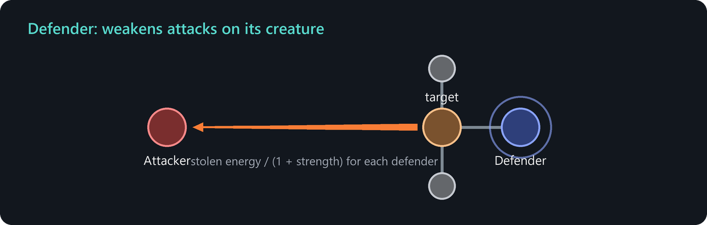

### Modes

| Mode | Effect |
| --- | --- |
| Anti-attacker | If an attacked cell is such a defender or is directly connected to such defenders, the stolen energy is divided by (1 + **Anti-attacker strength**) for each of these defenders. |
| Anti-injector | If the target of an injector is directly connected to such defenders, the energy cost of the injection increases by the **Anti-injector strength** for each of them. |

**Parameters:** group *Cell type: Defender* with **Anti-attacker strength** and **Anti-injector strength**, both 0.5 by default.

## Reconnector

A reconnector creates connections to other objects or removes them. Creatures can use it to hold on to rocks, to grab prey or to join other creatures.

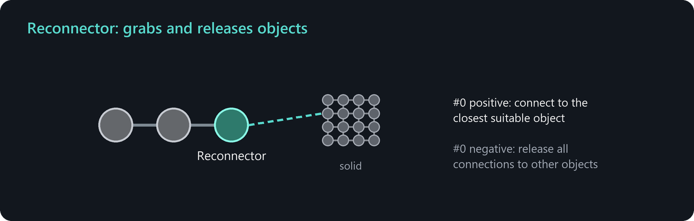

### Signals

| Channel | Meaning |
| --- | --- |
| #0 (input) | At least 0.1: connect to the closest suitable object. At most -0.1: remove all connections to objects that do not belong to the own creature. |
| #2 (output) | 1 if a connection was created or removed, otherwise 0. |

### Modes

| Mode | Connects to |
| --- | --- |
| Solid | Solid objects. |
| Free cell | Free cells, optionally restricted to colors. |
| Creature | Cells of other creatures, optionally restricted by size, color and lineage. |

An object can have at most six connections, so a reconnector only connects if both sides have a free slot.

**Parameter:** *Cell type: Reconnector > Radius* (2 by default).

## Detonator

A detonator explodes after a countdown and pushes everything around it away.

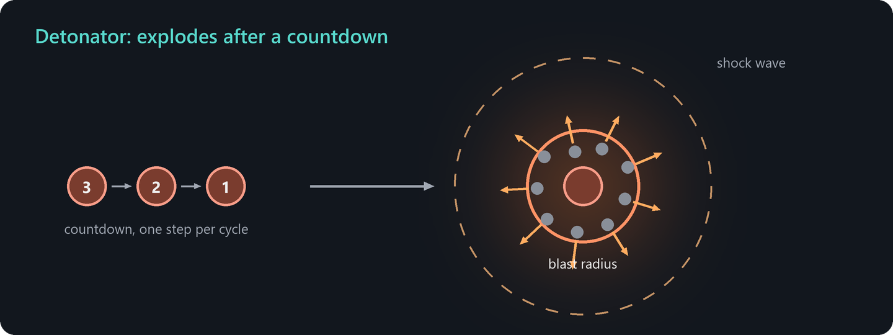

### Signals

| Channel | Meaning |
| --- | --- |
| #0 (input) | Starts the countdown if the absolute value is at least 0.1. |

### How detonation works

Once triggered, the detonator counts down one step per cycle. At zero it explodes: all objects within the **blast radius** are pushed away, the more strongly the closer they are. Other detonators within the radius explode as well with the **chain explosion probability**. A shock wave then travels outwards to eight times the blast radius. Static objects are not affected. An exploded detonator stays inactive.

### Properties

| Property | Meaning |
| --- | --- |
| Countdown | Number of cycles between trigger and explosion. One cycle comprises 6 time steps. |
| State | *Ready*, *Activated* or *Exploded* (inspection only). |

**Parameters:** group *Cell type: Detonator* with **Blast radius** (10 by default) and **Chain explosion probability** (0.2 by default).

## Digestor

A digestor converts raw energy into usable energy. It is the stomach of a creature.

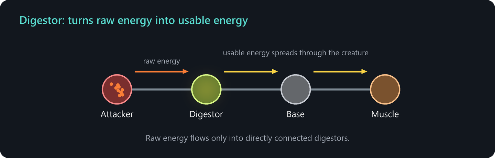

### How digestion works

Cells gain raw energy by absorbing energy particles and by attacks. Raw energy flows from any cell into directly connected digestors, and digestors pass it on to other connected digestors. In every cycle, each digestor converts part of its raw energy into usable energy, which then spreads through the creature with the normal energy flow.

The two properties of a digestor are complementary: a high **energy conductivity** means that the digestor passes on more raw energy to other digestors and converts less itself. A high **energy conversion** means the opposite.

### Properties

| Property | Meaning |
| --- | --- |
| Energy conductivity | How much raw energy the cell takes in and passes on. Scaled by the parameter **Max raw energy conductivity**. |
| Energy conversion | How much raw energy the cell converts per time step. Scaled by the parameter **Max raw energy conversion**. |

**Parameters:** group *Cell type: Digestor* with **Max raw energy conductivity** and **Max raw energy conversion**.

**Example:** Every attacker needs a digestor as a direct neighbor. Plant-like creatures that live from energy particles grow best when most of their cells are digestors.

## Memory

A memory cell keeps signals over time. It can delay, record, store and smooth signals and gives creatures a short-term memory.

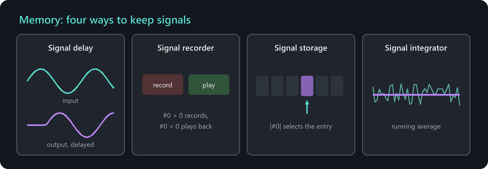

### Modes

| Mode | Function |
| --- | --- |
| Signal delay | Outputs the signal again after a fixed number of cycles. |
| Signal recorder | A positive channel #0 (at least 0.1) records the following signals into the buffer, one entry per cycle, until it is full. A negative channel #0 (at most -0.1) plays the recording back, one entry per cycle. |
| Signal storage | The absolute value of channel #0 selects a buffer entry: 0 selects the first entry, 1 the last one. A value of 0 or more reads the entry, a negative value overwrites it with the current signal. |
| Signal integrator | Outputs a running average of the signal. |

### Properties

| Property | Meaning |
| --- | --- |
| Delay | For signal delay: the number of cycles, at most 32. |
| Read only | For recorder and storage: the cell only reads from the buffer and never overwrites it. A read-only recorder plays back whenever channel #0 has an absolute value of at least 0.1. |
| New signal weight | For the integrator: the weight of the current signal in the average. At 0 the stored value is frozen, at 1 there is no smoothing. |
| Channel mask | Selects the channels that are replaced by the stored values. All other channels pass through unchanged. |
| Signal buffer | Opens an editor for the stored entries, which is useful to predefine a sequence for a read-only recorder. The buffer holds up to 32 entries. |

**Example:** A read-only recorder with a predefined sequence of directions, triggered by a generator, lets a creature perform a fixed dance or swimming pattern.

## Communicator

A communicator exchanges signals between different creatures. It allows swarms, warnings and cooperation.

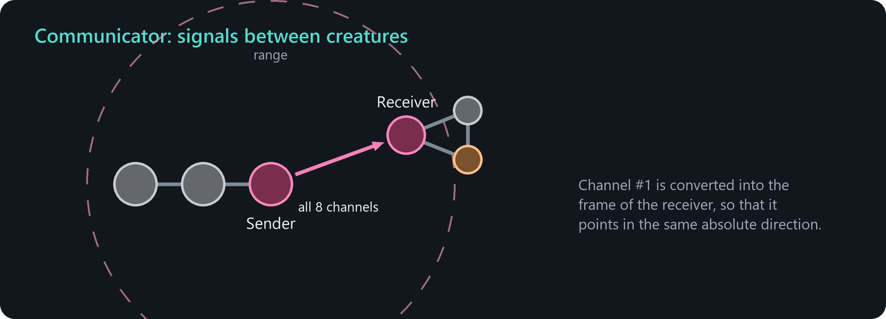

### Signals

| Channel | Meaning |
| --- | --- |
| #0 (input, sender) | Triggers a transmission if the absolute value is at least 0.1. |
| all (sender) | All eight channels of the sender are transmitted. |
| #1 | Interpreted as a direction. It is converted into the frame of reference of the receiver, so that it points in the same absolute direction. |
| all (output, receiver) | The receiver takes over the channels of the sender. Its neighbors read them in the next cycle. |

Communication only takes place between different creatures, and both sides need a valid front direction.

### Modes

| Mode | Properties |
| --- | --- |
| Send | **Range**: the radius in which receivers are addressed, at most 20. **One-way**: only receivers on the side opposite to the direction encoded in channel #1 are addressed. |
| Receive | **Restrict to colors** and **Restrict to lineage** select which senders are accepted. |

## Void

A void cell is a placeholder. It dissolves as soon as the cell network it belongs to is complete and passes its energy to its neighbors.

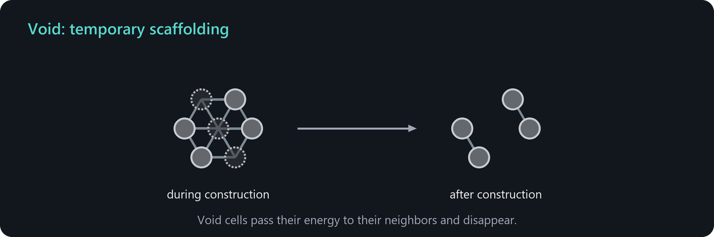

Void cells are useful for shapes that cannot be built directly. The shape generators build the cells in a fixed pattern, and void nodes reserve positions that are freed afterwards, for example to create gaps, holes or separate pieces. The first and the last node of a gene cannot be void, and void cells cannot carry a constructor.

## Constructor

A constructor builds new cells from a gene of the genome. It is not a cell type but an addition that any cell except void cells can carry. In the genome editor it is enabled by choosing a gene for **Construction**. Constructors are how creatures grow and reproduce.

### Signals

| Channel | Meaning |
| --- | --- |
| #0 (input) | Triggers the construction of the next cell if no auto trigger interval is set and the absolute value is at least 0.1. |
| #4 (output) | 1 if a cell was built in this cycle, 0 if an attempt failed. |

### How construction works

When triggered, the constructor builds the next cell of its gene. Each new cell costs the **normal energy** of a cell, 100 by default. The constructor pays from its energy reserve first and then from its own usable energy, but it never goes below the normal energy itself. If the energy is not sufficient and the external energy pool is available, it requests energy from there, see [Energy](energy.md#the-external-energy-pool).

New cells are inserted between the constructor and the previously built cell. The first node of a gene therefore ends up farthest away from the constructor, and the last node next to it. All cells of a construction stay inactive until the last cell is built. If **Separation** is enabled, the finished cells detach and form a new creature.

### Properties

| Property | Meaning |
| --- | --- |
| Auto trigger interval | The constructor triggers itself every n time steps. Without a value, channel #0 triggers it. |
| Construction angle | Direction of the first new cell, relative to the middle of the largest gap between the existing connections of the constructor cell. |
| Provide energy | *Cell only*: the constructor pays for each new cell. *Transitive cells*: it also pays an energy reserve for the constructors in the new cells, so they can build their own genes without further energy. *Free*: no energy cost. It cannot be set in a genome. Seeds created with energy use it, and it falls back to *Cell only* after the first offspring. |
| Separation | The finished construction detaches and becomes a new creature. |
| Number of branches | How many copies of the gene are built next to each other around the constructor (without separation). |
| Concatenations | How often the gene is built in a row, each copy attached to the previous one. Can be infinite. |
| Gene index | The gene that is built. |

**Parameters:** group *Cell construction* with **Connection distance**, which postpones a construction if the new connection would cross existing connections nearby, and group *Guided energy supply* for the external energy. The [Genomes and construction](genomes.md) chapter explains how constructors, genes and shapes work together.
