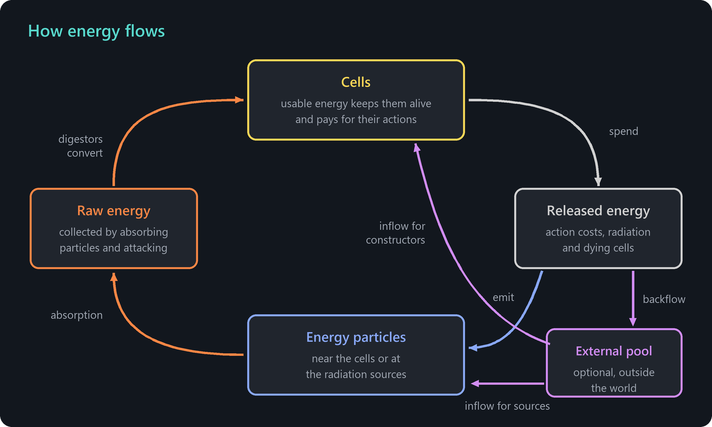

# Energy

Energy is the currency of life in ALIEN. Cells need it to exist, to act and to build offspring. Understanding where energy comes from and where it goes is the key to stable ecosystems and successful evolution experiments.

## Forms of energy

| Form | Where it is |
| --- | --- |
| Usable energy | In every cell. It keeps the cell alive and pays for its actions. |
| Raw energy | In cells. Unprocessed energy from absorbed particles and attacks, which digestor cells convert into usable energy. |
| Energy reserve | In constructor cells. Energy set aside for construction, filled for example by the external energy pool. |
| Stored energy | In depot cells. |
| Object energy | In solids, fluids and free cells. It determines their brightness, and for free cells it is food. |
| Energy particles | Free energy that drifts through the world. |
| External energy | In the external energy pool outside the world, if used. |

The energy inside the world is conserved. It changes its form, but it never appears or disappears, with one exception: the external energy pool can supply energy to the world and take energy back. The evolution dashboard shows the internal and the external energy.

## How cells gain energy

- **Absorbing energy particles.** When an energy particle hits a cell or a free cell, the cell absorbs a part of it given by the **Absorption factor**, 1 by default. Absorbed energy becomes raw energy. Fluids let energy particles pass, while solids and most static objects reflect them.
- **Attacking.** Attacker cells steal energy from other cells and free cells. The loot also becomes raw energy.
- **Digesting.** Digestor cells convert raw energy into usable energy. Raw energy flows from every cell into directly connected digestors.
- **Sharing.** Usable energy flows along connections between cells. Cells with more energy give to cells with less, and cells that do not need energy themselves pass their surplus above the normal energy to connected cells that are constructing.
- **External inflow.** Constructors that lack energy can receive energy from the external energy pool.

## How cells lose energy

- **Construction.** Every new cell costs the normal energy, 100 by default.
- **Actions.** Attacks, injections and muscle movements can cost energy, as set in the parameter groups of the cell types.
- **Radiation.** Cells can emit energy continuously. *Radiation type I* lets cells older than a minimum age emit a fraction of their energy per time step. *Radiation type II* lets cells emit energy as long as their energy is above a threshold. Both are off by default.
- **Death.** Dying cells disintegrate and release all their energy.

## Where released energy goes

Whenever energy is released, for example as an action cost, through radiation or because a cell dies, it becomes an energy particle:

1. If the **Backflow** of the color is greater than zero, that fraction of the energy flows back into the external energy pool, as long as the pool holds less than the **Backflow limit**.
2. The rest becomes an energy particle. With the base **Relative strength**, the particle is created right next to the cell. Otherwise it is created at one of the **radiation sources**, chosen according to their relative strengths.

## Energy particles

- Energy particles fly in a straight line until they are absorbed or bounce off a solid.
- Particles that come close to each other merge into one larger particle.
- A particle with more energy than the **Minimum split energy** splits into two after a while.
- If **Energy to cell free transformation** is enabled, a particle turns into a free cell as soon as its energy reaches the normal energy.
- Free cells disintegrate into energy particles again when their energy falls below the minimum energy or when they exceed the **Maximum free cell age**.

## Radiation sources

A radiation source is a place where energy particles appear. Sources are added in the window **Simulation parameters** with **Add radiation source**. Each source has a position, an optional velocity, a circular or rectangular shape and an optional **Radiation angle** that makes all its particles fly in one direction.

A source receives energy in two ways:

- A share of all energy released in the world, given by its **Relative strength**. The relative strengths of all sources and of the base add up to 1.
- Energy from the external energy pool, given by **Inflow for sources**.

Radiation sources create fertile places where plant-like creatures can live from the particles. Combined with radiation of the cells, they keep energy circulating.

## The external energy pool

The parameter group **Guided energy supply** controls an energy pool outside the world:

| Parameter | Meaning |
| --- | --- |
| External energy amount | The energy in the pool. It can be infinite. |
| Inflow for constructors | The maximum energy a constructor cell receives from the pool per construction attempt when it lacks energy. If the pool cannot satisfy all requests, the energy is distributed proportionally. |
| Inflow threshold factor | The fraction of the required energy that a constructor must have by itself before it may request energy from the pool. |
| Inflow only for first offspring | Only constructors that have not produced an offspring yet receive energy. Constructors that build parts of their own creature are not restricted. |
| Inflow for sources | The energy per time step that flows from the pool to the radiation sources. |
| Backflow | The fraction of released energy that flows back into the pool. |
| Backflow limit | Backflow stops while the pool holds more than this amount. |

With an external pool and a backflow, the total of internal and external energy stays constant, and you can control the amount of life in the world through the size of the pool.

## Typical setups

**Closed cycle for evolution.** Fill the external pool, give constructors an inflow, set a backflow of 0.5 to 1 and a finite maximum age for cells. Old cells die, their energy returns to the pool, and new offspring can be built from it. The population settles at a level that depends on the size of the pool.

**Radiation-driven ecosystem.** Place radiation sources and let them draw from the external pool with **Inflow for sources**. Plant-like creatures with many digestor cells absorb the particles, herbivores attack the plants and predators attack the herbivores.

**Free energy for art.** Seeds created with **Create seed with energy** build their first creature without any energy. For decorative scenes, no energy supply is needed at all, as long as the creatures do not reproduce.

## Troubleshooting energy

- **The population explodes and the simulation slows down.** There is too much energy. Reduce the external energy amount or the inflow, or add radiation and a maximum age.
- **Creatures do not build anything.** Their constructors lack energy. Check the external energy amount and **Inflow for constructors**, or give the creatures a way to collect energy.
- **Everything dies after a while.** Energy leaks out of the creatures faster than they can collect it. Check action costs and radiation, and make sure that released energy can be found again, for example through backflow or radiation sources.
- **Attackers gain nothing.** Every attacker needs a directly connected digestor cell.
