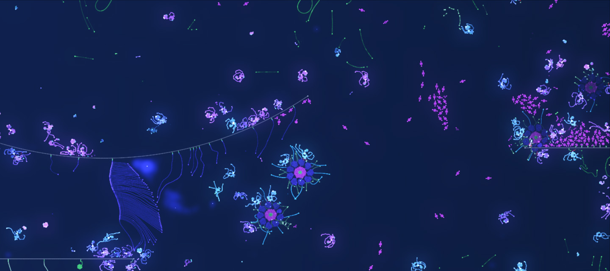

# Evolution experiments

Evolution needs three ingredients: creatures that **replicate**, offspring that **vary** because of mutations, and **selection**, because resources are limited and not every creature can survive. ALIEN provides all three. Your task is to set up the conditions and to observe what happens. This chapter shows how.

## Start with a preset

The quickest way to experience evolution is a ready-made experiment:

1. Open the **Browser** (Alt+B), choose the tab **Simulations** and the workspace **Featured**.
2. Open a simulation from the folder **Evolution Presets**, for example *Hanging Garden/Base*.
3. Open the **Evolution dashboard** (Alt+3) and run the simulation.

Evolution takes time. Interesting changes often appear only after hundreds of thousands or millions of time steps. Let the simulation run for a long time, if necessary in the [console mode](user-interface.md#console-mode) (Alt+C), which leaves all computing power to the simulation. The folder **Evolution Results** contains snapshots of the same experiments after long runs, so you can see what may emerge.

## Watching evolution

The **Evolution dashboard** (Alt+3) is your laboratory instrument:

- The **cards** at the top show how many creatures, cells and lineages exist and how much energy is in the world and in the external pool.
- The **plots** show the development over time: number of creatures, average number of cells per creature, average number of genome nodes, average generation and internal energy. A rising number of genome nodes indicates that genomes become more complex.
- The **lineage table** lists the groups of related creatures. A new lineage is founded whenever the accumulated mutations of a creature exceed the parameter **New lineage threshold**. Click the button of a lineage to open the genome of its most advanced creature in the genome editor.

The **object coloring** in the simulation parameters (group *Visualization*) can color creatures by lineage. Then you can see directly how lineages spread and displace each other.

## Ingredient 1: Replicators

A replicator is a creature whose genome contains a constructor that builds the root gene (gene 0) with **Separation** switched on. The [tutorial](first-creature.md#step-7-let-it-reproduce) shows how to create one. Important settings of the constructor:

- **Auto trigger interval** sets how often the constructor tries to build the next cell. Smaller values mean faster reproduction.
- **Provide energy** decides whether the constructor pays only for each new cell or also provides an energy reserve for the constructors inside the offspring. See [Genomes and construction](genomes.md#energy-for-construction).
- **Separation** must be on for the constructor that builds the offspring. Constructors that build parts of the own body keep it off.

## Ingredient 2: Variation

Mutations happen when a genome is passed on to an offspring. **The mutation rates are stored in every genome**, so different creatures can mutate differently. A new genome has all mutation probabilities set to zero, so nothing mutates until you set rates.

Open the genome in the genome editor. In the left column, the group **Mutation rates** lists the active mutations. The button **Edit** opens a dialog with all rates. There are two groups of mutations:

**Changes of properties.** For each of these you set a probability and the strength of the change. Each comes in two variants, *Mutation rate 1* and *Mutation rate 2*, so you can combine frequent small changes with rare large ones.

| Mutation | What changes |
| --- | --- |
| Connection mutations | The weights with which a cell reads the signals of its neighbors |
| Neuron mutations | Weights, biases and activation functions of the neural networks |
| Cell type property mutations | The settings of the cell types, for example the range of a sensor |
| Geometry mutations | The stiffness and the shape generator of genes |
| Constructor mutations | The settings of constructors, or a constructor is added or removed |

**Changes of the structure.** These have a probability only.

| Mutation | What changes |
| --- | --- |
| Cell type mutations | A node gets a different cell type |
| Cell type mode mutations | A cell type switches to a different mode, for example a sensor to another detection mode |
| Customization mutations | A color of the genome is replaced by another one |
| Void mutations | A node is toggled between void and a real cell type |
| Extend gene and Add node mutations | New nodes are added to genes |
| Trim gene and Delete node mutations | Nodes are removed |
| Copy and Move node section mutations | Groups of nodes are copied or moved between genes |
| Add, Duplicate, Delete and Swap gene mutations | Genes are created, copied, removed or exchanged |

Every mutation is explained in detail in its tooltip. As a starting point, probabilities between 0.001 and 0.01 work well. Too high rates destroy working genomes faster than selection can keep up.

### Letting evolution choose the rates

Instead of setting the rates by hand, you can let them evolve. If the option **Apply meta-mutations** of a genome is switched on, which is the default, every probability in the genome changes slightly whenever the genome is passed on. The strength of these changes is set in the parameter groups *Meta-mutations* of the simulation parameters. They are 0 by default, which switches meta-mutations off.

The evolution presets use this approach. Their genomes start with all probabilities at zero, and the meta-mutation parameters are set to 0.0002. Over millions of time steps the successful lineages arrive at probabilities between about 0.0001 and 0.015, different for each kind of mutation.

## Ingredient 3: Selection

Selection arises automatically when resources are limited. In ALIEN, the central resource is **energy**. Every new cell costs energy, so a population can only grow as long as energy is available. Creatures that gather energy more efficiently produce more offspring.

There are two basic ways to supply energy:

- **External energy pool.** The parameter group *Guided energy supply* contains an energy pool outside the world. Constructors draw energy from it when they build new cells (**Inflow for constructors**), and radiation sources can draw from it to emit energy particles (**Inflow for sources**). When cells release energy, a part of it flows back into the pool (**Backflow**). This creates a cycle that keeps the total energy constant.
- **Energy in the world.** Energy particles from radiation sources, free cells and the cells of other creatures are food. Creatures with sensors, attackers and digestors can collect it. This leads to plants, herbivores and predators.

To keep evolution going, old creatures must make room for new ones. A **Maximum age** for cells (group *Cell life cycle*) ensures that creatures die eventually and return their energy.

## A recipe for your own experiment

1. Create a new world (Ctrl+N), for example 1000 x 600, with an **Energy** of 1,000,000 for the external pool.
2. Design a replicator in the genome editor or open a genome from the browser.
3. Set mutation rates in the genome, for example a probability of 0.005 for neuron, connection and cell type property mutations and 0.001 for add node and delete node mutations. Alternatively, set all *Meta-mutations* parameters to 0.0002 and let the rates evolve.
4. In the simulation parameters, set **Maximum age** to about 50,000 time steps and **Backflow** to 0.8, so that the energy of dead cells mostly returns to the pool.
5. Place a few seeds with **Create seed with energy** and run the simulation.
6. Watch the evolution dashboard. If the population explodes, reduce the external energy or the inflow. If it dies out, increase them or give the creatures more time to reproduce.

The preset *Hanging Garden* follows this pattern. It uses an external pool of 12 million energy units, a backflow of 0.8, maximum ages between 120,000 and 500,000 time steps and meta-mutations of 0.0002, and it adds layers with gravity and storms that make the world diverse.

## Shaping the environment

The environment determines which creatures succeed. Some possibilities:

- **Layers** change parameters in parts of the world, for example a zone with higher friction, a death zone with low energy limits or a current that carries creatures along. See [Simulation parameters](simulation-parameters.md#layers-and-radiation-sources).
- **Radiation sources** emit energy particles at fixed places, which creates fertile spots.
- The **food chain color matrix** (group *Cell type: Attacker*) decides which colors can eat which. Together with customization mutations it allows complex food webs.
- **Solid structures** such as walls, rocks and labyrinths divide the world into habitats.

## Tips

- Save your experiment regularly, or switch on **Autosave** (Alt+5), which keeps a series of save points.
- Use **flashbacks** to try out parameter changes and to return if they were a bad idea.
- Running experiments for days is easier with the [command line interface](files.md#command-line-interface), which runs a simulation file without any window.
- Ask an [AI agent](ai-agents.md) to monitor the experiment, analyze the lineages and suggest parameter changes.
