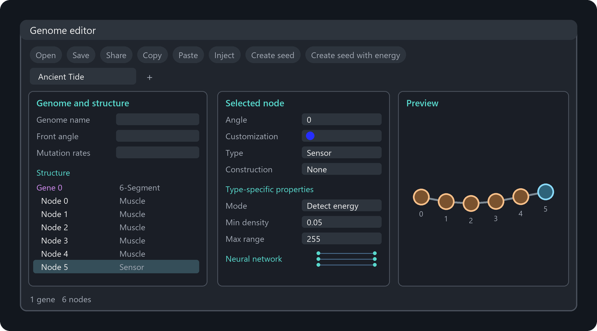
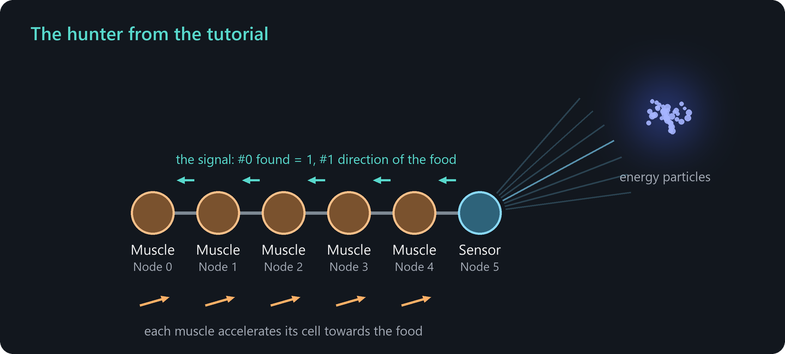

# Your first creature

In this tutorial you design a small creature in the genome editor, bring it to life and teach it to hunt for food. In the end it will even reproduce. It takes about 15 minutes. You learn how genes and nodes work, how signals flow through a creature and how a constructor builds offspring.

The [How life works](how-life-works.md) chapter explains the ideas behind the steps. Reading it first is helpful but not required.

## Step 1: Prepare an empty world

A small, empty world makes it easy to watch your creature.

1. Choose **Simulation > New** (Ctrl+N).
2. Enter a **Width** of 600 and a **Height** of 400.
3. Set **Energy** to 100000. This fills the external energy pool, which we need later for reproduction.
4. Switch off **Adopt parameters**, so that the new world starts with the default simulation parameters.
5. Click **OK**.

The world is empty and paused. Zoom in a little so that the middle of the world fills the screen.

## Step 2: Open the genome editor

Choose **Editor > Genome editor** (Alt+W). The editor opens with a new genome that has a randomly generated name. It is divided into three columns:

- **Left:** the properties of the whole genome and below them the **Structure**, a list of all genes and their nodes. The new genome contains one gene, *Gene 0*, with a single node.
- **Middle:** the properties of the gene or node that is selected in the structure list.
- **Right:** a live **preview** that shows how the creature looks and behaves.

## Step 3: Build a body

Our creature will be a short chain of six cells.

1. Click **Gene 0** in the structure list. In the middle column you see the gene properties. The **Shape generator** is *Segment*, which arranges the cells in a line. Keep it.
2. Click the button **Add node to the selected gene** below the structure list five times. The gene now has six nodes, *Node 0* to *Node 5*, and the preview shows a chain of six cells.

Every node becomes one cell. The cells are built in the order of the nodes, and the signal of the creature will flow from the last node towards node 0.

## Step 4: Give it eyes and legs

Now the cells get their abilities.

1. Click **Node 5** in the structure list. In the middle column, set **Type** to *Sensor*. In the type-specific properties below, set **Mode** to *Detect energy*. This cell will look for concentrations of energy particles.
2. Click **Node 0** and set **Type** to *Muscle* and **Mode** to *Direct movement*.
3. Repeat the previous step for **Node 1** to **Node 4**.

Here is what happens in the finished creature. In every cycle, the sensor scans its surroundings. If it finds energy particles, it writes a 1 into channel #0 of its signal and the direction of the find into channel #1. The neighboring muscle cell copies this signal, the next one copies it again, and so on. A muscle in the mode *Direct movement* accelerates its cell in the direction given by channel #1, with a strength given by channel #0. So the whole creature moves towards the food.

## Step 5: Bring it to life

1. Click the button **Create seed with energy** in the tool bar of the genome editor. It shows a seedling with a lightning bolt. A seed appears in the middle of the view. A seed is a single cell that builds the creature from the genome. The variant with energy builds the first creature for free.
2. Press **Space** to run the simulation. The seed builds one cell after another. After a few hundred time steps the creature is complete and detaches from the seed.

Without food in sight, the sensor finds nothing and the creature drifts.

## Step 6: Feed it

1. Press **Alt+E** to enter the edit mode.
2. Choose the tool **Disc-shaped object network** in the tool bar.
3. In its option card, set **Material** to *Energy particles*, the **Outer radius** to 4 and the **Energy** to 30.
4. Left click into the world about 50 units away from your creature.

A glowing cloud of energy particles appears. Your creature turns towards it and accelerates. After several hundred time steps it dives into the cloud, and its cells absorb the energy particles on contact. Usually the creature overshoots, turns around and comes back.

> **Tip:** Place more food at different spots and watch how the creature always heads for the nearest one. Sensors report the closest match they can see.

## Step 7: Let it reproduce

A creature reproduces when one of its cells builds a copy of the root gene and releases it.

1. Return to the genome editor and click **Node 2**.
2. Set **Construction** to *Gene 0*. The node now carries a constructor that builds gene 0, the body of the creature itself. The construction properties appear in the middle column.
3. Switch on **Separation**. When the copy is complete, it detaches and becomes a new creature.
4. Select your old creature in the world, if you like, and press **Del** to delete it. Then click **Create seed with energy** again.

Run the simulation. Building a cell costs energy, and the creatures get it from the external energy pool that you filled in step 1. Soon there are two creatures, then four, then many more. When the pool is empty, the growth stops. The [Evolution dashboard](user-interface.md#evolution-dashboard) (Alt+3) shows the number of creatures and the remaining external energy.

## What you have learned

- A **genome** consists of genes, and a gene consists of nodes. Every node becomes one cell.
- The **cell type** of a node determines what the cell can do.
- **Signals** flow from cell to cell, by default from the last node towards node 0. Put sensors at the end and the cells that act in front of them.
- A **seed** builds a creature from its genome. **Create seed with energy** gives the first creature for free.
- A **constructor** that builds the root gene with **Separation** turns a creature into a self-replicator. It needs energy for every new cell.

## Ideas for further experiments

- Change the sensor mode to *Detect creature*. Your creatures will now chase each other.
- Change the **Shape generator** of gene 0 to *Hexagon* or *Large Lolli* and watch the preview.
- Add a second gene with a few muscle cells in the mode *Auto bending* and let node 0 construct it. The creature grows a tail.
- Give the genome mutation rates (left column, **Mutation rates**) and start an [evolution experiment](evolution.md).
- Read [Cell types](cell-types.md) for all abilities and [Genomes and construction](genomes.md) for all genome settings.
