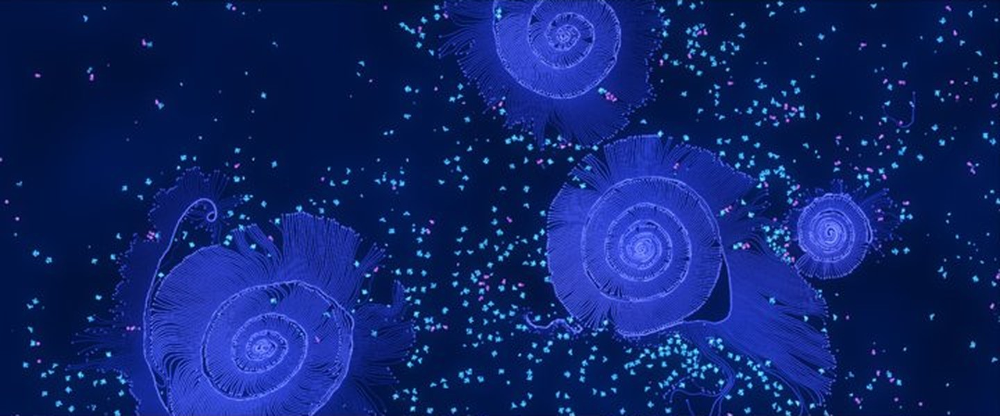

# Generative art

ALIEN renders every particle with light and color, and evolution and physics constantly produce new forms. This makes it a tool for living, moving artworks. This chapter collects the settings and techniques that matter for beautiful pictures and scenes.

## Get inspired

The browser (Alt+B) contains a folder **Artwork** in the workspace **Featured**. Open the simulations there, look at how they are built and change them. Inspect their creatures with **Alt+N** and their genomes with **Alt+F** to learn how the shapes were grown.

## Colors and light

The look of a world is controlled by the parameter group **Visualization** in the window **Simulation parameters** (Alt+4):

- **Background color** sets the color of empty space.
- **Customization colors** defines the palette of ten colors that all objects use. Changing a palette entry recolors every object of that color at once.
- **Object coloring** decides how objects are colored:
  - *Energy* draws everything in grayscale.
  - *Customization* uses the palette color of each object.
  - *Lineage + Customization* keeps the palette color but shifts the hue slightly per lineage.
  - *Lineage* and *Creature* give every lineage or every creature its own color.
- **Glow** controls the bloom effect that makes bright objects shine.
- **Borderless rendering** repeats the world periodically, which is useful for seamless patterns.
- **Grid lines** and **Mark reference domain** draw helper lines, which you usually switch off for pictures.

The **brightness** of an object follows its energy. Objects with little energy look dim, energetic objects bright. Use this deliberately: give a rock zones with different energies to shade it, or keep creatures at a higher energy so that they stand out.

> **Tip:** Dense fluids with high energy and high glow add up to a saturated white. For colorful liquids, use a low energy per particle, for example 10 to 15, a glow of at most 0.4 and an object distance of 1.2 or more.

## Painted backgrounds

**Layers** can paint the background. A layer covers a circular or rectangular area, and its **Background color** tints this area when the color override of the layer is enabled. Layers fade out at their edges, so several overlapping layers blend into soft color fields.

A layer with a **force field** additionally darkens the background according to the height map of the field if **Show force field** is enabled. A *Perlin noise* field changes over time, so its background turns into slowly drifting clouds, even if the strength of the field is set to 0. This is an easy way to paint a living nebula behind a scene.

See [Simulation parameters](simulation-parameters.md#layers-and-radiation-sources) for all layer settings.

## Growing shapes from genomes

Genomes are the most powerful tool for art. A few techniques:

- **Shapes.** Every gene has a shape generator: *Segment*, *Triangle*, *Rectangle*, *Hexagon*, *Tube*, *Large Lolli*, *Small Lolli* and *Zigzag*. Hexagons and lollis make petals, discs and heads, segments make stems and tentacles.
- **Branching.** A constructor with several **branches** builds the same gene multiple times around a cell, up to six times. This creates stars and pinwheels.
- **Concatenations.** A constructor can build a gene several times in a row. Combined with a small angle at the first and last node, this produces curved stems and spirals.
- **Recursion.** A constructor that builds its own gene creates endless branching structures such as dendrites, lichen or fractal trees. Two such constructors at opposite angles give a tree. Add a constructor that builds a flower gene to grow blossoms at the tips.
- **Free energy.** **Create seed with energy** builds the first creature without energy cost, so even large structures appear without any energy supply. Recursive copies count as new creatures and need energy, for example from the external energy pool, which also limits how far the structure grows.
- **Infinite age.** Keep the **Maximum age** at infinity for art, so that grown structures do not fall apart.

The [Genomes and construction](genomes.md) chapter explains every constructor setting.

## Color changes over time

The expert setting **Object color transition rules** in the simulation parameters lets the colors of cells and free cells change over time. For each color you define a following color and a duration. Cycles of colors make creatures shimmer or let a scene pass through different moods. Fluids keep their colors.

## Taking pictures

- **Simulation > Save picture** renders the current view into an image file. You can choose a width and height larger than the screen for high resolution prints.
- **View > Render UI** (Alt+U) hides all windows, which gives a clean view for screen recordings.
- **F7** switches to full screen.
- An [AI agent](ai-agents.md) can take screenshots through the MCP server and search for good camera positions.

## Ideas

- Fill a world with a sparse fluid in several colors and let a radial force field stir it into a galaxy.
- Grow a garden of fractal trees on rocks under a slowly drifting nebula.
- Convert a drawing with the image converter (Alt+Y) and let it crumble under gravity by lowering the **Maximum force**.
- Let an evolution experiment run for a day and color the creatures by lineage. The result is a living map of their history.
