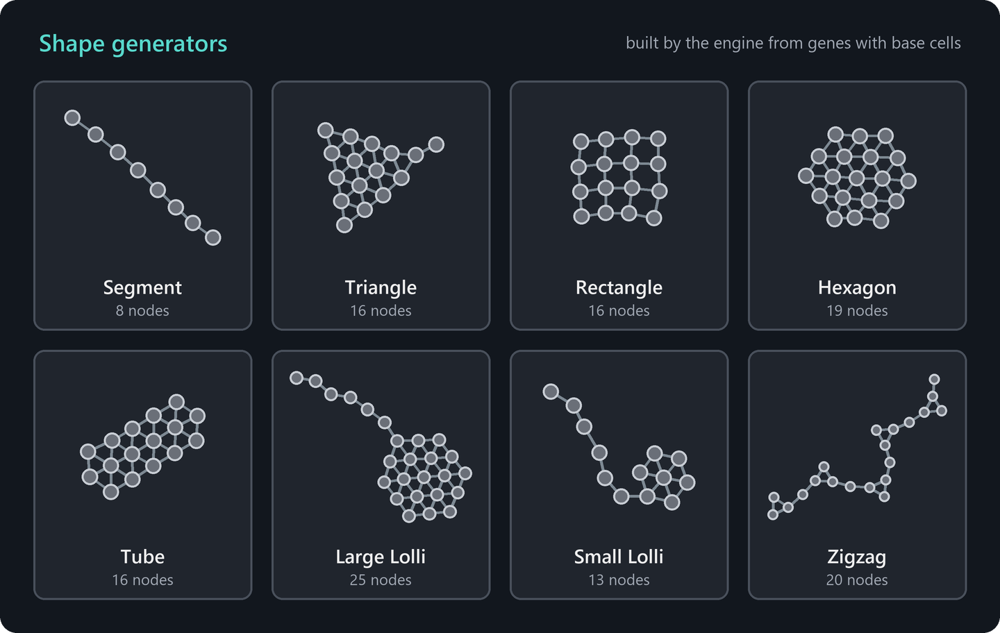
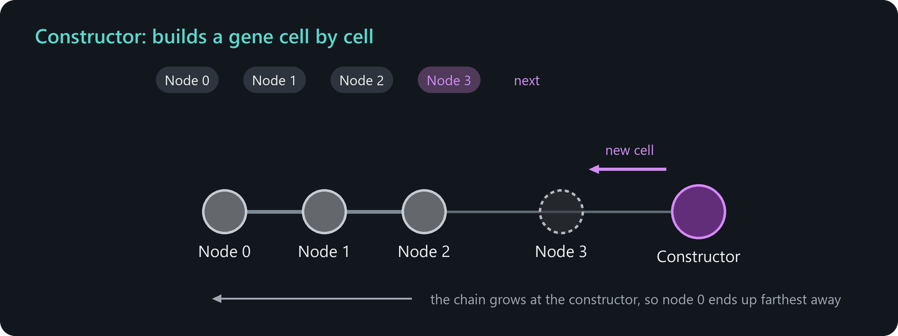

# Genomes and construction

The genome is the blueprint of a creature. This chapter explains its structure, all of its settings and how constructors turn it into cells. It also describes the genome editor in detail. For a hands-on introduction, start with [Your first creature](first-creature.md).

## Structure of a genome

A genome has three levels:

| Level | Contains |
| --- | --- |
| **Genome** | A name, the front angle, the mutation rates and a list of genes. |
| **Gene** | A shape generator, the connection distance, the stiffness and a list of nodes. |
| **Node** | Everything about one cell: angle, color, cell type with its properties, neural network and optionally a constructor. |

The first gene, gene 0, is the **root gene**. It describes the body of the creature. Further genes are built by constructors, which turns them into limbs, organs or ornaments of the same creature, or into new creatures if the constructor uses **Separation**.

## The genome editor

Open the genome editor with **Editor > Genome editor** (Alt+W). Each open genome has its own tab. The **+** at the end of the tab bar creates a new genome. The editor shows three columns:

- **Left column.** The genome properties, the active mutation rates and the **Structure** list. The list shows every gene with its nodes. For each gene it shows the colors used, the number of nodes and the shape, the genes it references and the genes that reference it. For each node it shows the color, the cell type and the gene it constructs. Genes that cannot be reached from the root gene are highlighted, because they are never built. The buttons below the list add genes and nodes, remove the selection and move it up or down.
- **Middle column.** The properties of the selected gene or node, including the neural network of a node.
- **Right column.** A live **preview** of the creature. It simulates the construction in a small separate world. The preview buttons switch on a detailed simulation that includes signals and muscles and show the neural activity editor, in which you can set signal values and watch how the creature reacts.

The tool bar at the top offers:

| Button | Function |
| --- | --- |
| Open genome, Save genome | Load and save genome files (*.genome*). |
| Share genome | Upload the genome to the server so that it appears in the browser. |
| Clone genome | Open a copy of the current genome in a new tab. |
| Copy genome, Paste genome | Exchange genomes via the clipboard. |
| Close other tabs | Close all tabs except the current one. |
| Create save point, Revert to save point | Remember the current state of the genome and return to it later. |
| Change colors | Replace one color by another in all nodes. |
| Inject genome | Replace the genome of the selected creatures in the simulation by the current genome. |
| Create seed | Place a seed with this genome in the middle of the view. It needs energy to build its creature. |
| Create seed with energy | Place a seed that builds its first creature without energy cost. |

> **Tip:** To edit the genome of an existing creature, select one of its cells in edit mode and press **Alt+F**. The genome opens in a new tab. After editing, select the creatures and use **Inject genome**, or create new seeds.

## Genome properties

| Property | Meaning |
| --- | --- |
| Genome name | Name of the genome. Every creature built from it inherits the name. |
| Front angle | Defines the front direction of the creature as the angle between the first connection of the head cell and the front. New genomes in the editor start with -180 degrees, which makes the front point away from the rest of the body. |
| Resistance to injection | Injector cells of other creatures cannot take over cells of this creature. |
| Apply meta-mutations | The mutation rates of this genome are themselves mutated, see [Evolution experiments](evolution.md#letting-evolution-choose-the-rates). |
| Mutation rates | The probabilities and strengths of all mutations. The button **Edit** opens the full list. |

## Gene properties

| Property | Meaning |
| --- | --- |
| Gene name | A name that is only shown in the structure list. |
| Shape generator | Determines the angles and the additional connections with which the nodes are assembled. See below. |
| Connection distance | The distance between two cells that are built one after another, between 0.5 and 1.5. Larger values make the creature bigger. |
| Stiffness | How strongly the cells resist the deformation of their connections, between 0.05 and 1. Low values make soft, wobbly bodies. |
| Homogeneous cell type | Every cell of this gene uses the cell type and the cell type properties of the first node. Colors, angles, neural networks and constructors remain individual per node. |

### Shapes

The shape generator arranges the nodes of a gene into a geometric pattern. It also adds connections between cells that are next to each other in the pattern, which makes the shape stable.

| Shape | Description |
| --- | --- |
| Segment | A line of cells. Only the first and the last node can be bent with their angle. |
| Triangle | A filled triangle that grows edge by edge. |
| Rectangle | A filled square that grows ring by ring. 4, 9, 16 or 25 nodes give complete squares. |
| Hexagon | A filled hexagon that grows in rings around the center. 7, 19 or 37 nodes give complete hexagons. |
| Tube | A band of cells, two cells wide. |
| Large Lolli | A hexagonal head of 19 cells, followed by a thin tail for all further nodes. |
| Small Lolli | A small head, followed by a thin tail. |
| Zigzag | A thick line that changes its direction back and forth. |

The picture above shows the shapes with 12, 16, 16, 19, 20, 27, 19 and 16 nodes.

## Node properties

| Property | Meaning |
| --- | --- |
| Angle | The angle of this cell relative to the connection to the previous cell. It is only evaluated for the first and the last node of a gene. For the inner nodes the angle results from the shape. |
| Customization | The color of the cell. Many simulation parameters are defined per color. |
| Type | The cell type and its properties, see [Cell types](cell-types.md). |
| Construction | The gene that this cell builds as a constructor, or *None*. Choosing a gene shows the construction properties. |
| Neural network | The weights, biases and activation functions of the neural network of the cell, see [Neural networks and signals](neural-networks.md). |

## How construction works

A constructor builds the cells of its gene one after another, one cell per trigger:

1. The first cell of a new branch is placed next to the constructor in the direction given by the **Construction angle**, measured from the middle of the largest gap between the existing connections of the constructor cell.
2. Each following cell is inserted between the constructor and the previously built cell. The chain therefore grows at the constructor, and the **first node ends up farthest away** while the last node ends up next to the constructor.
3. The shape generator adds connections between the new cell and its neighbors in the pattern.
4. While the construction is running, all its cells are in the state *Under construction* and inactive.
5. When the last node is built, the cells are activated. With **Separation**, the last cell is not connected to the constructor, so the result detaches and becomes a new creature.

Because each cell copies the signal of its first connection by default, and the first connection of node *i* points to node *i+1*, signals flow from the last node towards node 0. Place sensors at the end of a gene and acting cells in front of them.

### Constructor properties

| Property | Meaning |
| --- | --- |
| Auto trigger interval | The constructor tries to build the next cell every n time steps. The phase differs per creature, so creatures do not build in sync. Without a value, the constructor is triggered via channel #0. |
| Construction angle | The direction of the first cell, see above. It is only used for the first cell of the first concatenation in the first branch. |
| Provide energy | See [Energy for construction](#energy-for-construction). |
| Separation | The finished construction detaches and becomes a new creature. |
| Number of branches | How many copies of the gene the constructor builds around itself, up to 6. Only without separation. |
| Concatenations | How often the gene is built in a row, each copy attached to the end of the previous one. Choose infinity for structures that grow without end. |

The output channel #4 of a constructor cell reports 1 when a cell was built and 0 when an attempt failed.

### Energy for construction

Every new cell costs the **normal energy** of the constructor color, 100 by default. The constructor pays from its **energy reserve** first and then from its usable energy. It only builds if it keeps at least the normal energy itself. Cells of the creature that do not need energy pass their surplus to connected cells that are building, so the whole creature helps.

The setting **Provide energy** decides how far this support reaches:

- **Cell only.** The constructor pays only for the cell it is building.
- **Transitive cells.** When the constructor builds a cell that carries a constructor itself, it additionally gives that cell an energy reserve that covers all cells of the gene this new constructor will build. If that constructor also uses *Transitive cells*, the reserve covers everything that can be reached from it. Creatures can thus be equipped with the energy for their limbs from the start. This does not apply to constructors that build the root gene.
- **Free.** No energy cost at all. This option cannot be set in a genome. It is used by seeds created with **Create seed with energy** and falls back to *Cell only* after the first completed offspring.

If a constructor lacks energy and the parameter **Inflow for constructors** is greater than zero, it requests energy from the external energy pool, see [Energy](energy.md#the-external-energy-pool).

## Head cell and front direction

When a constructor creates a new creature, the cell of node 0 becomes the **head cell**. It defines the **front direction** of the creature: the front angle of the genome is measured from the first connection of the head cell. From the head cell, the front direction is passed on to every other cell of the creature at regular intervals. Sensors, muscles and communicators use it as their frame of reference.

The head cell also keeps the creature together. Cells that lose their connection to the head cell, for example because the creature was torn apart, do not receive these updates anymore and start dying after a short time.

## Seeds

A **seed** is a single cell with a constructor that builds the root gene with separation. The genome editor creates seeds with **Create seed** and **Create seed with energy**. A seed created without energy needs energy from the external pool or from its surroundings before it can build anything.

## Rules for valid genomes

The genome editor and the simulation keep genomes valid:

- The first and the last node of a gene cannot be void, and void cells cannot carry a constructor.
- Constructors may reference any gene. A cycle through the root gene is the normal case of reproduction. A cycle that does not pass through the root gene means unbounded growth within one creature. Such cycles are allowed in designed genomes, which is useful for fractal structures, but they are removed when a genome mutates.
- When a genome mutates, at most two different genes can be built with separation, and nodes that would end up disconnected from the rest of their gene are turned into void nodes.
