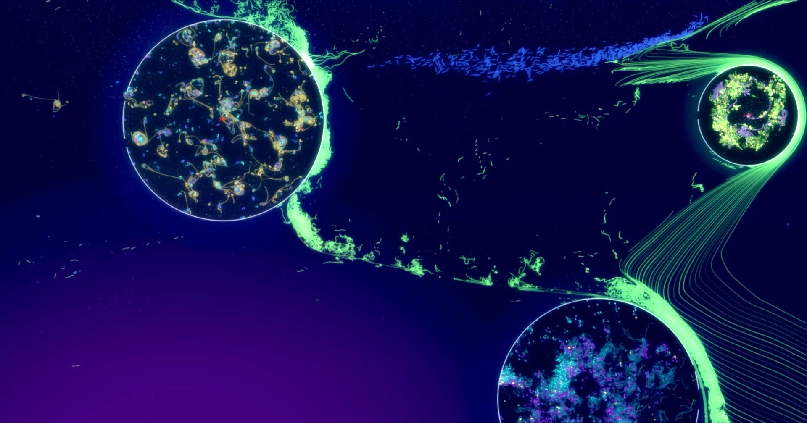

# Getting started

Welcome to **ALIEN**, the **A**rtificial **LI**fe **EN**vironment. ALIEN simulates a two-dimensional world made of particles. Particles can form rocks, liquids and soft bodies, and they can become living cells. Cells join into creatures that sense their surroundings, move, eat, fight and build offspring from a genome. Everything runs on your graphics card, so worlds with millions of particles evolve in real time.

This documentation grows with you. The chapters under **Start here** get you going within minutes. The chapters under **Explore** introduce the big topics step by step. The chapters under **Reference** describe every detail, for example every cell type and every simulation parameter. Use the search field above the table of contents whenever you are looking for something specific.

> **Tip:** Press **F1** at any time to open or close this documentation.

## What you can do with ALIEN

ALIEN has three main uses, and many people enjoy all of them:

- **Evolution simulations.** Seed a world with self-replicating creatures, switch on mutations and watch how populations adapt, compete and form ecosystems. ALIEN is used to study how complexity arises from simple building blocks. See [Evolution experiments](evolution.md).
- **Sandbox game.** Draw rocks, pour liquids, build machines and creatures, then smash them with the mouse. The physics engine reacts instantly while the simulation is running. See [Sandbox and editing](sandbox.md).
- **Generative art.** Evolution and physics produce endless forms. With colors, glow, force fields and painted backgrounds, ALIEN becomes a tool for living, moving artworks. See [Generative art](generative-art.md).

> **Let an AI agent do the work.** ALIEN contains a built-in MCP server. Connect an AI agent to it and simply describe what you want, for example *"Build a coral reef with swimming creatures"* or *"Find out why my population dies out"*. The agent can create worlds, design genomes, change parameters and take screenshots for you. See [AI agents](ai-agents.md) for the setup and many example prompts.

## Your first five minutes

ALIEN starts with a simulation already loaded. Try the following steps right away:

1. **Run and pause.** Press **Space** to start the simulation and press it again to pause it. The menu **Simulation** offers the same commands.
2. **Look around.** Turn the mouse wheel to zoom in and out. Hold the **middle mouse button** and drag to move the view. You can also hold the left mouse button to zoom in continuously and the right mouse button to zoom out.
3. **Watch closely.** Zoom in until you see single cells. Creatures consist of connected cells. Press **Alt+O** to switch on the cell info overlay, which labels each cell with its type when you are close enough.
4. **Open another world.** Press **Alt+B** to open the **Browser**. The tab **Simulations** lists the simulations of the ALIEN project under **Featured** and those shared by other users under **Community**. Double-click a simulation to download and open it.
5. **Touch the world.** Press **Alt+E** or click the round button in the lower left corner to enter the **edit mode**. While the simulation runs, choose the tool **Apply forces** in the tool bar next to the button and drag across the world to push everything around.

> **Note:** Large simulations need a powerful graphics card. If a world runs slowly, choose a smaller one in the browser. The number of time steps per second is shown in the window **Temporal control** (Alt+1).

## Where to go next

Choose the path that matches your interest:

| If you want to... | Read |
| --- | --- |
| understand the windows and controls | [The user interface](user-interface.md) |
| control ALIEN with an AI agent | [AI agents](ai-agents.md) |
| draw, build and play with physics | [Sandbox and editing](sandbox.md) |
| learn what cells and creatures are | [How life works](how-life-works.md) |
| design a creature yourself | [Your first creature](first-creature.md) |
| run your own evolution experiment | [Evolution experiments](evolution.md) |
| create beautiful pictures and scenes | [Generative art](generative-art.md) |

If you get stuck, have a look at [Troubleshooting](troubleshooting.md) or ask the community on the [ALIEN Discord server](https://discord.gg/7bjyZdXXQ2). Many videos about ALIEN can be found on the [YouTube channel](https://youtube.com/channel/UCtotfE3yvG0wwAZ4bDfPGYw).
