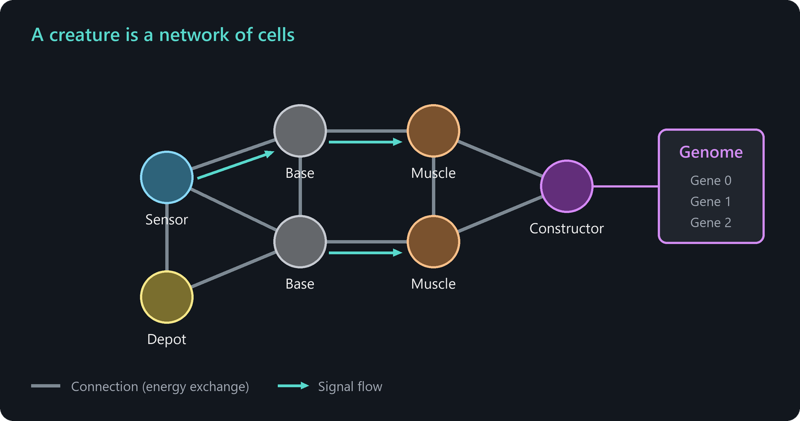
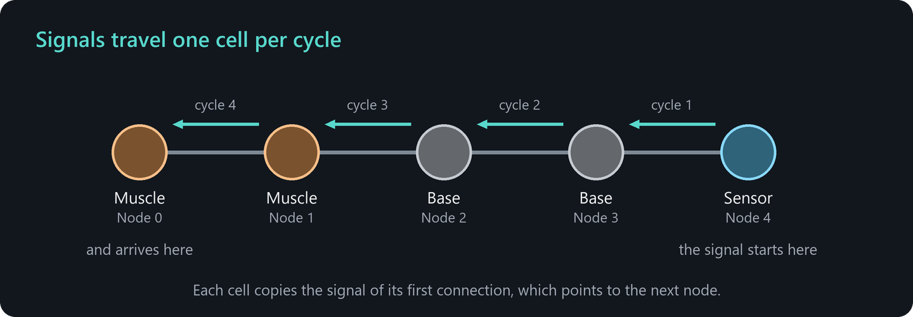
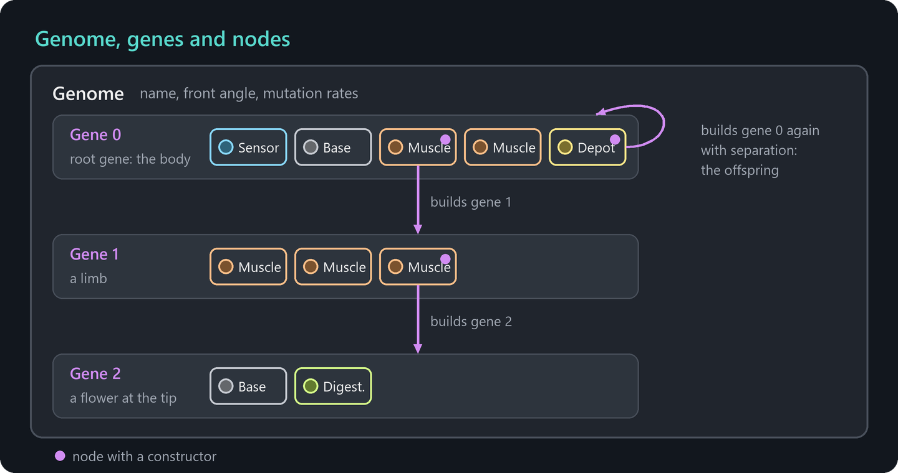

# How life works

This chapter explains the ideas behind the living part of ALIEN: what cells and creatures are, how they get energy, how they sense and act, and how they reproduce and evolve. It gives you the big picture. The details follow in the [reference chapters](cell-types.md).

## Cells and creatures

A **creature** is a network of **cells**. The cells are round particles like all other objects, but they are alive: each cell carries energy, has a **cell type** that determines its special ability and runs a tiny **neural network** that decides what the cell does. Cells are linked by **connections**, which hold the creature together like elastic bonds. Energy and information flow along these connections.

All cells of a creature share the same **genome**, the blueprint from which the creature was built.

## Energy keeps cells alive

Every cell needs energy, and there are two kinds of it:

- **Usable energy** keeps the cell alive and pays for its actions. If it falls below the **minimum energy** (50 by default), the cell starts to die. The **normal energy** (100 by default) is the typical amount a cell has. Building a new cell costs this amount.
- **Raw energy** is unprocessed food. Cells collect raw energy when they absorb energy particles or attack other cells. Only **digestor** cells can turn raw energy into usable energy.

Usable energy flows along the connections between cells, so well supplied cells feed their neighbors. Energy never appears out of nothing. When a cell pays for an action or dies, its energy is released as energy particles, which other cells can collect again. The only exception is the optional external energy pool, which you control in the simulation parameters. See [Energy](energy.md) for the complete picture.

## Sense, think, act

Cells act in **cycles**. Every 6 time steps, each cell does two things:

1. **Think.** The neural network of the cell calculates eight output values, the **signal**. Its inputs are the signals of the connected cells, a few memory values and some information about the cell itself, such as its energy and age.
2. **Act.** The cell type uses the signal. A muscle cell moves when its signal tells it to, a sensor cell writes what it has found into the signal, an attacker cell attacks when it is triggered, and so on.

The connected cells read this signal in the next cycle. In this way information travels through the creature from cell to cell. A sensor at one end of a creature can steer the muscles at the other end.

By default, the neural network of a cell simply copies the signal of its first connection, which points to the cell of the next node. Signals therefore flow from the last node of a gene towards node 0, against the order in which the cells were built, without any further setup. This makes it easy to build working creatures: put a sensor at the end of a gene and muscles in front of it.

The signal consists of eight **channels**, numbered #0 to #7. Most cell types use channel #0 as their trigger or strength, and some use further channels, for example #1 for a direction. The meaning of every channel is listed in [Cell types](cell-types.md). How to design your own neural networks is described in [Neural networks and signals](neural-networks.md).

## The genome is the blueprint

A genome is organized in three levels:

- The **genome** holds a list of **genes** and some general settings, such as the mutation rates.
- A **gene** describes a group of cells and its geometric **shape**, for example a straight segment, a triangle or a hexagon.
- A **node** describes a single cell of a gene: its cell type, its color, its neural network and an angle.

The first gene is the **root gene**. It describes the body of the creature. A node can additionally carry a **constructor**. A cell with a constructor builds the cells of another gene, cell by cell. This is how creatures grow arms, organs or flowers, and how they build offspring.

New creatures start as a **seed**: a single cell whose constructor builds the root gene. Once the body is complete, the constructors inside it start to work.

## Reproduction and evolution

A creature reproduces when one of its constructors builds the root gene again and **separates** the result. The new cells then form an independent creature, the **offspring**, which receives a copy of the genome.

When the genome is passed on, it can **mutate**. Each genome contains its own mutation rates, which determine how likely changes are: a different weight in a neural network, a new node, a lost gene, a different cell type and many more. Most mutations are harmful, some are neutral and a few are beneficial. Creatures with beneficial mutations collect more energy, build more offspring and spread. This is evolution.

Related creatures form a **lineage**. When the mutations of a creature have added up beyond a threshold, it founds a new lineage. The [Evolution dashboard](user-interface.md#evolution-dashboard) shows how lineages grow and shrink.

## Death

A cell starts to die when:

- its usable energy falls below the minimum energy, for example because it was attacked,
- it reaches the maximum age, if one is set,
- it has lost the connection to the **head cell** of its creature, for example because the creature was torn apart.

Dying cells disintegrate over time and release their energy as energy particles. In this way the energy returns to the world and can feed others.

## The cell types at a glance

| Cell type | Ability |
| --- | --- |
| [Base](cell-types.md#base) | No special ability. Only the neural network runs. Good for relaying signals and for structure. |
| [Depot](cell-types.md#depot) | Stores usable energy and releases it again on demand. |
| [Sensor](cell-types.md#sensor) | Scans the surroundings for energy, solids, free cells or other creatures. |
| [Generator](cell-types.md#generator) | Produces a periodic signal, like a heartbeat. |
| [Attacker](cell-types.md#attacker) | Steals energy from free cells or from cells of other creatures. |
| [Injector](cell-types.md#injector) | Infects foreign cells with its own genome, like a virus. |
| [Muscle](cell-types.md#muscle) | Moves the creature by bending, stretching or pushing. |
| [Defender](cell-types.md#defender) | Protects against attackers or injectors. |
| [Reconnector](cell-types.md#reconnector) | Creates or removes connections to other objects. |
| [Detonator](cell-types.md#detonator) | Explodes after a countdown. |
| [Digestor](cell-types.md#digestor) | Converts raw energy into usable energy. |
| [Memory](cell-types.md#memory) | Delays, records, stores or smooths signals. |
| [Communicator](cell-types.md#communicator) | Sends signals to other creatures. |
| [Void](cell-types.md#void) | A temporary placeholder that disappears after construction. |

The ability to construct other cells is not a cell type of its own. Any cell can additionally carry a [constructor](cell-types.md#constructor).
