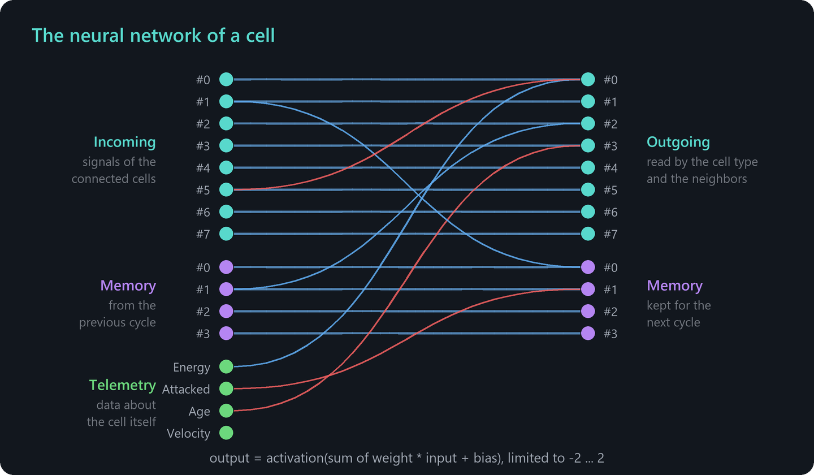

# Neural networks and signals

Every cell contains a small neural network. Together, the networks of all cells form the nervous system of a creature: they pass on what sensors perceive, combine information and control muscles and other cell types. This chapter explains how the networks compute, how signals travel and how you design networks in the genome editor.

## The cycle of a cell

Every 6 time steps, all cells execute one **cycle**:

1. **Gather inputs.** The cell collects the signals of its connected cells, its own memory values and some data about itself.
2. **Compute.** The neural network calculates 8 signal outputs and 4 memory outputs.
3. **Act.** The cell type reads its inputs from the 8 signal channels and may overwrite some of them with its results, for example a sensor writes what it found.

The resulting signal is what the connected cells see in the next cycle. A signal therefore needs one cycle to move from one cell to the next. Across a chain of ten cells it takes ten cycles, which is 60 time steps.



## Inputs

The network has 16 inputs:

| Inputs | Name in the editor | Meaning |
| --- | --- | --- |
| 1 to 8 | Incoming | Channels #0 to #7 of the signals of the connected cells. For each channel, the values of all connected cells are multiplied by their **connection weight** and added up. |
| 9 to 12 | Memory | The memory outputs of this cell from the previous cycle. |
| 13 | Energy | The usable energy of the cell relative to the normal energy. 1 means normal energy, the value is limited to 2. |
| 14 | Attacked | 1 if the cell was attacked recently, otherwise 0. |
| 15 | Age | The age of the cell. It reaches 1 at an age of 100,000 time steps and stays there. |
| 16 | Velocity | The speed of the cell, limited to 2. |

The **connection weights** decide which neighbors a cell listens to. There is one weight for each of the up to six connections of a cell. By default, only the first connection has the weight 1 and all others 0.

## Outputs

The network has 12 outputs:

- **Outgoing** signal channels #0 to #7. They are visible to the connected cells and are used by the cell type of the cell itself.
- **Memory** values #0 to #3. They are only visible to the cell itself and serve as inputs in the next cycle. This gives a cell a state that persists over time.

Each output is calculated as

```
output = activation(sum of weight * input + bias)
```

and is then limited to the range from -2 to 2.

### Memory outputs

The memory outputs are special: they are only recalculated when the first input, which is channel #0 of the incoming signals, is greater than 0.1. Otherwise they keep their previous values. This first input acts as a gate and does not contribute to the memory outputs itself. With this gate, a creature can store a value at a certain moment, for example the direction in which it last saw food.

### Activation functions

| Function | Behavior |
| --- | --- |
| Tanh | Smooth curve between -1 and 1. Good for limiting and for soft decisions. |
| Binary step | 1 for inputs of 0 or more, otherwise 0. Good for switches. |
| Identity | Passes the value unchanged. This is the default. |
| Absolute value | Makes negative values positive. |
| Gaussian | 1 at 0 and falling towards 0 for larger values in both directions. Good for detecting whether a value is close to zero. |
| Mod | Wraps the value into the range from -1 to 1. Useful for angles. |

## The default network

A new node has a network that simply copies: each incoming channel is connected to the outgoing channel with the same number with a weight of 1, each memory input to the memory output with the same number, all biases are 0 and all activation functions are *Identity*. Together with the default connection weights, a cell therefore copies the signal of the cell at its first connection.

In a gene, the first connection of each node points to the next node, and the first connection of the last node points to the constructor that built it. The genome editor sets the connection weight of the last node to 0, so it does not listen to its constructor. As a result, signals flow through a gene from the last node towards node 0. This is why sensors belong at the end of a gene and muscles in front of them.

## Signal channels and cell types

The channels have no fixed meaning by themselves. They get their meaning from the cell types that read and write them. Most cell types use channel #0 as trigger or strength. The following channels are written by cell types:

| Channel | Written by |
| --- | --- |
| #0 | Sensor (found), Generator (value) |
| #1 | Sensor (direction), Injector (success), Communicator receiver (direction) |
| #2 | Sensor (mass), Attacker (success), Reconnector (success) |
| #3 | Sensor (distance) |
| #4 | Constructor (success) |

Memory cells and communicators can write all channels. The complete list is in [Cell types](cell-types.md#how-cell-types-work).

## The neural network editor

Select a node in the genome editor. The middle column shows its neural network as a graph:

- The **inputs** are on the left, grouped into *Incoming*, *Memory* and *Telemetry*. The **outputs** are on the right, grouped into *Outgoing* and *Memory*.
- Lines connect inputs and outputs. Blue lines are positive weights, red lines negative weights. The thicker a line, the larger the weight.
- A small marker next to each output shows its bias.
- Next to the outgoing channels, the editor shows which channels the cell type of the node reads and writes, for example *trigger*, *found* or *angle*.
- Click an input node and an output node to select the connection between them. A card shows its **Weight**, the **Bias** of the output and buttons for the **activation function** of the output.
- Below the graph, the **Connection weights** set how strongly the cell listens to each of its connections.

The preview of the genome editor can show a **neural activity editor**. There you can set the signal values of the cells by hand and watch how the creature in the preview reacts, which is a quick way to test a design.

## Examples

**Flee instead of approach.** A creature with a sensor and muscles in the mode *Direct movement* moves towards what the sensor detects. In the first muscle cell after the sensor, select the connection from incoming #1 to outgoing #1, set the **Bias** to 1 and the activation function to *Mod*. Adding 1 turns the direction by 180 degrees, and *Mod* wraps the result back into the valid range. The creature now flees from what it sees.

**A constant signal.** To activate muscles permanently, select the last node of the gene, set all its connection weights to 0 and give outgoing #0 a bias of 1. The cell outputs 1 in channel #0, and all cells in front of it copy this value.

**Store energy in good times.** In a depot cell, set the weight from incoming #0 to outgoing #0 to 0, the weight from the telemetry input *Energy* to outgoing #0 to 1 and the bias of outgoing #0 to -1. The output is positive when the cell has more than its normal energy, so the depot stores the surplus, and negative when the energy drops below normal, so the depot releases its reserve.

**Remember the last direction.** In the cell behind a sensor, set the weight from memory #0 to memory #0 to 0 and the weight from incoming #1 to memory #0 to 1. Channel #0 of the sensor is 1 whenever something is found, so the memory gate opens only then and memory #0 takes over the current direction. When the target disappears, the gate closes and memory #0 keeps the last known direction. Finally, set the weight from incoming #1 to outgoing #1 to 0 and the weight from memory #0 to outgoing #1 to 1, so that the cell passes on the remembered direction instead of the current one.

## Watching signals

- Cells light up briefly when their channel #0 changes strongly or when they are attacked.
- The **inspection window** of a cell (Alt+N in edit mode) shows the current values of its signal channels and memory.
- The [Cell info overlay](user-interface.md#menus) (Alt+O) labels the cells with their types.
