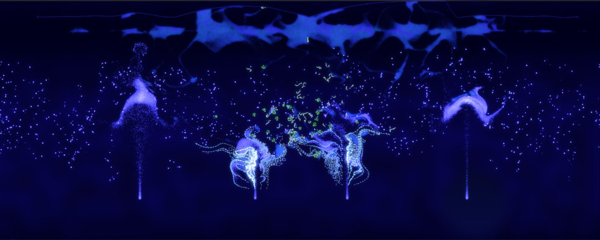

# Sandbox and editing

ALIEN is also a playground for physics. You can draw rocks and liquids, build structures, cut them apart, throw them at each other and watch how everything reacts. This chapter introduces the materials of the world and the editing tools. No knowledge about creatures is needed.

## Materials

Everything in the world consists of small round particles called **objects**. There are four kinds of objects plus free energy:

| Material | Description |
| --- | --- |
| **Solid** | Particles that are connected to each other and form elastic bodies such as rocks, walls or machines. Connections break when the force becomes too large. Solids block the view of sensor cells. |
| **Fluid** | Particles without connections that flow like a liquid or a gas. Fluids can glow. |
| **Free cell** | Organic matter without a genome. Free cells serve as food for creatures and decay when their energy is too low. |
| **Cell** | The building block of creatures. Cells have a genome, a small neural network and a cell type. They are not drawn by hand but grow from seeds, see [Your first creature](first-creature.md). |
| **Energy particle** | Free energy that drifts through the world. Cells absorb energy particles on contact. |

Every object has a few basic properties:

- **Color.** One of ten customization colors. Many simulation parameters can be set per color, so colors are more than decoration. For example, a solid of color 3 can be made more fragile than one of color 4.
- **Energy.** The energy of an object also determines its brightness.
- **Stiffness.** How strongly the object resists the deformation of its connections.
- **Static.** Static objects stay in place, are not affected by forces and never age. Use them for walls and anchors.
- **Sticky.** Sticky objects form new connections when they touch other objects.

## Entering the edit mode

Press **Alt+E** or click the round button in the lower left corner. A tool bar appears next to the button. Most tools show a small card above the tool bar with their options and a hint how to use them. Press **Alt+E** again to return to the navigation mode.

## Creating matter

Choose one of the creation tools in the tool bar:

| Tool | How to use it |
| --- | --- |
| **Draw freehand** | Hold the left mouse button and paint. The pencil radius sets the width of the stroke. |
| **Single object** | Left click to place one object or energy particle. |
| **Rectangular object network** | Left click to place a rectangle of connected objects. |
| **Hexagonal object network** | Left click to place a hexagon, built from layers around the center. |
| **Disc-shaped object network** | Left click to place a disc. An inner radius greater than 0 creates a ring. |
| **Object network along a line** | Left click to add points, right click to remove the last point, **Enter** to finish, **Esc** to abort. |
| **Object network along a Bezier curve** | Like the line, but the points define a smooth curve. |
| **Polygon-shaped object network** | Like the line, but the points define the outline of a filled polygon. |

The option card of each tool sets the **color**, the **material**, the **energy**, the **distance** between neighboring objects and the stiffness, plus **Sticky** and **Static**. Fluids additionally have a **glow** value. With the material *Energy particles*, the tools create free energy instead of matter.

> **Tip:** The **Image converter** (Alt+Y or the button **Pattern from image**) turns any image file into a pattern of solid objects. Bright pixels become objects in the closest customization color. This is a quick way to bring logos or drawings into a world.

## Selecting and moving

With the tool **Select and move**:

- **Click** an object to select it. Hold **Ctrl** while clicking to add objects to the selection or to remove them.
- **Drag with the right mouse button** to select all objects inside a rectangle.
- **Drag with the left mouse button** to move the selection. If the simulation is running, the selection follows the mouse and keeps its momentum when you release it, so you can throw things.
- **Drag the round handle** above the selection frame to rotate the selection.
- Press **Esc** to deselect.

Two buttons in the tool bar decide what moving affects. **Apply to selected objects** moves only the selected objects, so their connections to unselected objects may tear. **Apply to entire networks** moves the complete networks that the selected objects belong to. Holding **Shift** switches temporarily between both. **Glue on contact** connects moved objects to everything they touch.

## The action bar of a selection

A small action bar floats above every selection:

- **Color**, **Stickiness** and **Static** change these properties for all selected objects.
- **Make uniform velocities** gives all selected objects the same velocity, so that they move as one block.
- **Release stresses** adopts the current distances of the connections as their rest lengths, which removes tension.
- **Glue selection** connects neighboring objects inside the selection.
- **Multiply** creates copies of the selection, either in a grid or at random positions in the whole world.
- **Copy** (Ctrl+C) and **Delete** (Del). **Paste** (Ctrl+V) inserts the copy in the middle of the view and selects it, so you can drag it to its place.
- **Inspect** opens inspection windows for the selected objects, genomes or creatures.
- **Transform** sets position, velocity, rotation angle and angular velocity numerically.

## Cutting and pushing

- **Scissors.** Hold the left mouse button and drag across connections to cut them. With **Only in selection**, only connections between selected objects are cut.
- **Apply forces.** Hold the left mouse button and drag to push everything under the cursor in the direction of the movement. This tool is available while the simulation is running.

## Inspecting and changing single objects

Select one or more objects and press **Alt+N**, or use **Inspect** in the action bar. An inspection window opens for each object (up to 20 at once). It shows every property and lets you change it: position, velocity, energy, color, static and sticky, the connections and, for cells, the cell type, the neural network and much more. **Esc** closes all inspection windows.

## Mass operations

**Tools > Mass operations** (Alt+H) changes many objects at once. It randomizes properties within ranges: the colors of cells and genomes, energies, ages, the countdowns of detonator cells, lineage ids, the glow of fluids and the mutation rates of genomes. With **Restrict to selection**, only the selected objects are changed. This is useful to create variation, for example different shades in a large rock or different colors in a population.

## Physics in a nutshell

A few simulation parameters shape how matter behaves. You find them in the window **Simulation parameters** (Alt+4), see [Simulation parameters](simulation-parameters.md) for all details:

- **Friction** slows down all motion. Without friction, things keep moving forever.
- **Maximum force** decides when connections break. Low values make solids fragile.
- **Rigidity of solids** makes connected solids move more like rigid bodies.
- **Pressure**, **Viscosity** and **Smoothing length** control the behavior of fluids.
- There is no gravity by default. A **layer** with a linear force field adds gravity, wind or currents to the whole world or to a part of it.

> **Tip:** Create a flashback (window **Temporal control**) before an experiment. **Load flashback** brings back the previous state, so you can try things as often as you like.
