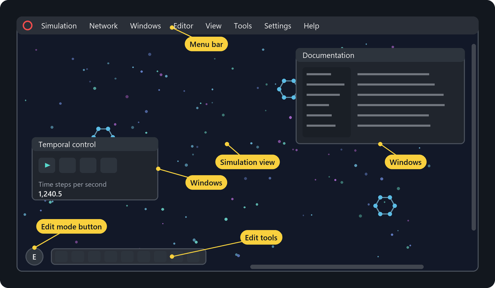

# The user interface

This chapter is a tour through the screen of ALIEN. The first sections explain everything you need for daily use. The later sections describe each window and dialog in more detail and can be used as a reference.

## The main screen

The screen consists of only a few parts:

- **Menu bar.** It runs along the top edge and gives access to every function. The power button at its left end closes ALIEN.
- **Simulation view.** The world fills the whole screen behind all windows. Scrollbars at the right and bottom edges show which part of the world is visible.
- **Edit mode button.** The round button in the lower left corner switches between the navigation mode and the edit mode. In edit mode, a tool bar with editing tools appears next to the button.
- **Windows.** Windows float above the simulation view. You can move them by their title bar, resize them at their edges and collapse or close them with the buttons in the title bar. All windows can be opened again from the menus.

Short messages such as *Run* or *Copied to clipboard* appear briefly in the lower part of the screen. They can be switched off under **View > Message overlay** (Alt+X).

> **Tip:** Hover the mouse over almost any button, property or parameter to see a tooltip that explains it. The tooltips are the fastest way to learn the meaning of a setting.

## Navigating the world

In navigation mode, the mouse controls the view:

| Action | Mouse |
| --- | --- |
| Zoom in or out | Turn the mouse wheel |
| Zoom in continuously | Hold the left mouse button |
| Zoom out continuously | Hold the right mouse button |
| Move the view | Hold the middle mouse button and drag |

The window **Spatial control** (Alt+2) shows the world size, the zoom factor and the center of the view. It has buttons to zoom in and out, to center the view and to change the world size. The option **Autotracking on selection** keeps the selected objects in the middle of the view, which is handy for following a creature.

The world has no edges. Objects that leave it on one side come back on the opposite side, as if the world were wrapped around a doughnut. The simulation parameter **Borderless rendering** draws the world repeatedly so that this becomes visible.

## Running the simulation

Press **Space** to run or pause the simulation. The window **Temporal control** (Alt+1) offers more control:

- **Run** and **Pause** start and stop the simulation.
- **Process single time step** calculates exactly one time step while the simulation is paused. **Load previous time step** goes back again. This is useful for examining what happens in detail.
- **Create flashback** stores the current world in memory and **Load flashback** returns to it later. Use a flashback before you try something risky.
- **Time steps per second** shows the current speed. **Slow down** limits the speed, for example to watch fast events.
- **Sync with rendering** couples the number of time steps to the number of rendered frames. This gives smooth motion at the cost of speed.

## Edit mode

In edit mode you can select, move, create and change objects. Enter it with **Alt+E** or the round button in the lower left corner. The tool bar next to the button contains:

- **Select and move.** Click an object to select it, hold **Ctrl** to add to or remove from the selection, or drag a rectangle with the right mouse button. Drag the selection with the left mouse button to move it. While the simulation runs, you can also throw it. A frame with a rotation handle and a small action bar appears around the selection.
- **Apply forces.** Drag across the world to push the objects under the cursor. This tool works only while the simulation is running.
- **Scissors.** Drag across connections to cut them.
- **Draw freehand** and the shape tools for single objects, rectangles, hexagons, discs, lines, Bezier curves and polygons. They create new matter.
- **MCP server**, **Pattern from image** and **Paste** as shortcuts to the corresponding functions.
- **Apply to selected objects**, **Apply to entire networks** and **Glue on contact** control how moving and rotating affects connected objects.

The chapter [Sandbox and editing](sandbox.md) explains these tools in depth.

## Menus

| Menu | Contents |
| --- | --- |
| **Simulation** | New (Ctrl+N), Open (Ctrl+O), Save (Ctrl+S), Save picture, Run and Pause (Space) |
| **Network** | Browser (Alt+B), Login (Alt+L), Logout, Upload simulation (Alt+D), Upload genome (Alt+Q), Delete user |
| **Windows** | Temporal control (Alt+1), Spatial control (Alt+2), Evolution dashboard (Alt+3), Simulation parameters (Alt+4), Autosave (Alt+5), MCP server (Alt+6), Log (Alt+7) |
| **Editor** | Genome editor (Alt+W), Allow object editing (Alt+E), Inspect objects (Alt+N), Inspect genomes (Alt+F), Inspect creatures (Alt+P), Close inspections and Deselect (Esc), Copy (Ctrl+C), Paste (Ctrl+V), Delete |
| **View** | Cell info overlay (Alt+O), Message overlay (Alt+X), Render UI (Alt+U), Render simulation (Alt+I), Console mode (Alt+C) |
| **Tools** | Mass operations (Alt+H), Image converter (Alt+Y) |
| **Settings** | Save on exit, Dark mode, Display settings, Network settings, Debug mode |
| **Help** | About, Documentation (F1) |

Press **F7** to switch between full screen and a window. All shortcuts are listed in [Keyboard and mouse](keyboard-and-mouse.md).

## Windows

### Temporal control

Runs, pauses and steps the simulation, manages the flashback and shows the speed. See [Running the simulation](#running-the-simulation).

### Spatial control

Shows world size, zoom and view center, offers zoom buttons, autotracking and the zoom sensitivity. The button **Resize** changes the size of the world. See [Navigating the world](#navigating-the-world).

### Evolution dashboard

Shows the state of the world at a glance: cards with the numbers of solids, fluids, cells, free cells, energy particles, creatures and lineages and with the internal and external energy. Below, plots show how the number of creatures, the average numbers of cells and genome nodes, the average generation and the energy develop over time, either for the last time steps or for the entire history. A table lists the lineages, which are groups of related creatures, and can be filtered by color. Each lineage has a button that opens the genome of a representative creature in the genome editor. The dashboard is the main instrument for [evolution experiments](evolution.md).

### Simulation parameters

All rules of the world, such as friction, the energy of cells or the strength of attacks, are simulation parameters. The window shows the **base parameters**, which apply everywhere, plus any number of **layers** and **radiation sources**. A layer overrides parameters in a part of the world and can exert a force field. A radiation source emits energy particles. The filter field finds parameters by name. See [Simulation parameters](simulation-parameters.md).

### Autosave

Creates save points of the running simulation at regular intervals and lists them. The download button in a row loads that save point. You can also create and delete save points by hand. The settings define the interval, the number of files and the directory.

### MCP server

Starts and stops the built-in server for AI agents, shows the address to connect to and logs every command an agent sends. See [AI agents](ai-agents.md).

### Log

Shows the messages that ALIEN writes, for example when a simulation is loaded. The option **Verbose** shows more details. The same messages are written to the file *log.txt* next to the program.

### Genome editor

Designs and edits genomes, the blueprints of creatures. It shows the genome on the left, the properties of the selected gene or node in the middle and a live preview of the resulting creature on the right. See [Your first creature](first-creature.md) and [Genomes and construction](genomes.md).

### Inspection windows

In edit mode, select objects and press **Alt+N** to open an inspection window for each of them. It shows and edits every property: position, velocity, energy, connections, the cell type with its settings and the neural network. **Alt+P** shows the creature of a selected cell and **Alt+F** opens its genome in the genome editor. **Esc** closes all inspection windows.

### Browser

Lists the simulations and genomes on the ALIEN server. The tabs switch between **Simulations** and **Genomes**. **Featured** contains the simulations of the ALIEN project, **Community** those shared by users and **Private** your own uploads. Switch between the gallery view with preview pictures and the table view with folders. Double-click an entry to open it. After logging in, you can upload your own work and react to the work of others. See [Files and command line](files.md#sharing-in-the-browser).

## Dialogs

- **New simulation** (Ctrl+N) creates an empty world with a given width and height. **Energy** fills the external energy pool. With **Adopt parameters**, the simulation parameters of the current simulation are kept.
- **Save picture** renders the current view as an image file of any size.
- **Mass operations** (Alt+H) randomizes properties such as energy, age or color of many objects at once.
- **Image converter** (Alt+Y) turns an image file into a pattern of solid objects.
- **Display settings** sets full screen mode, resolution, frame rate and the scaling of the user interface.
- **Network settings** sets the server address.

## Console mode

**View > Console mode** (Alt+C) switches off the user interface and the rendering and continues the simulation in the console window, which leaves the full power of the graphics card to the simulation. This is useful for long runs. The console shows the progress. Press **Esc** to return to the user interface or **Q** to quit.
